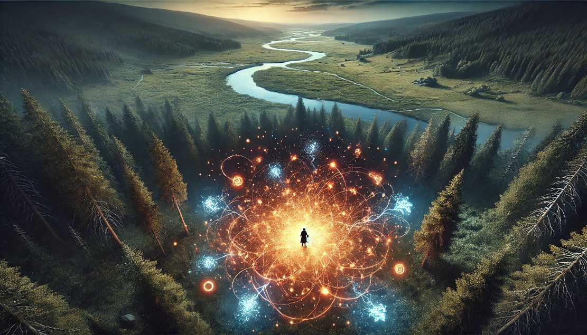
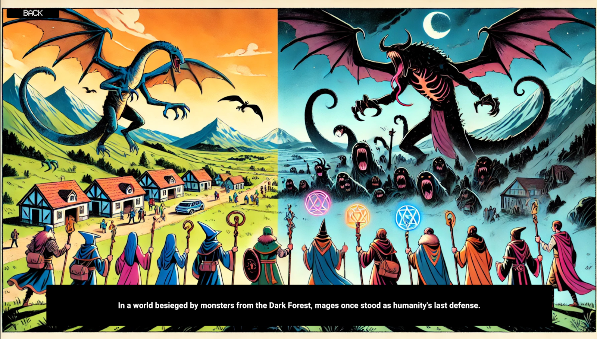
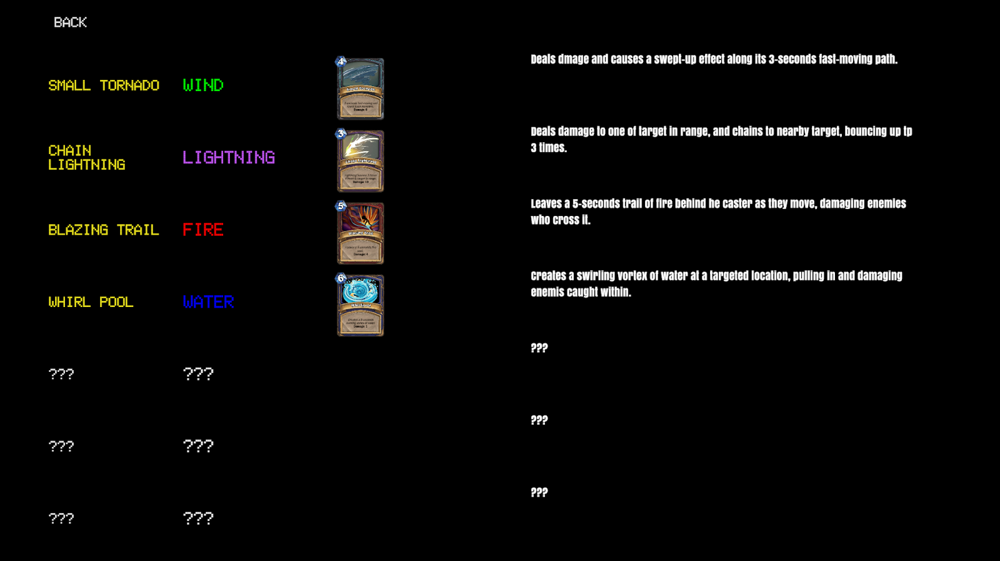
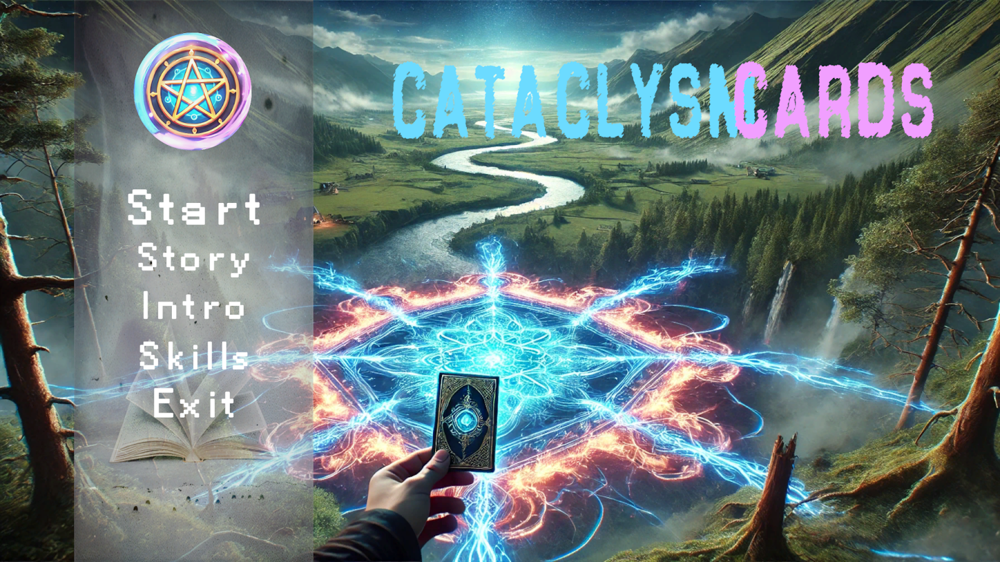
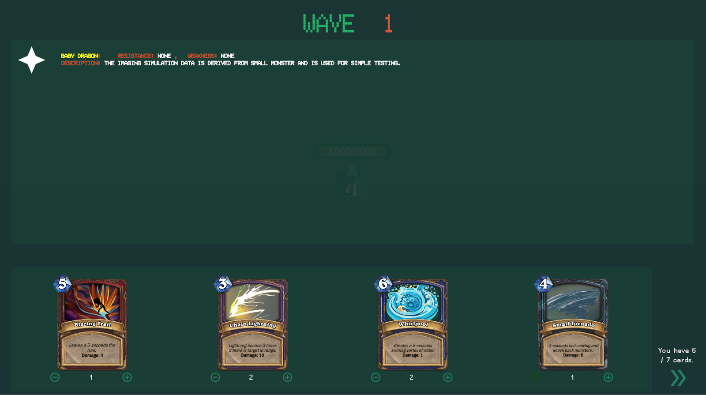
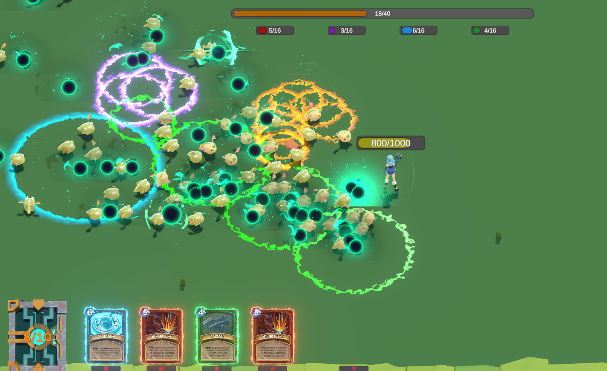
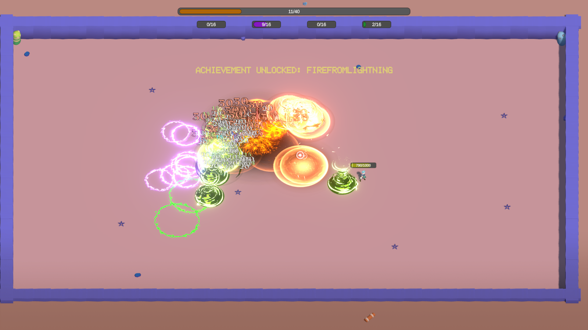
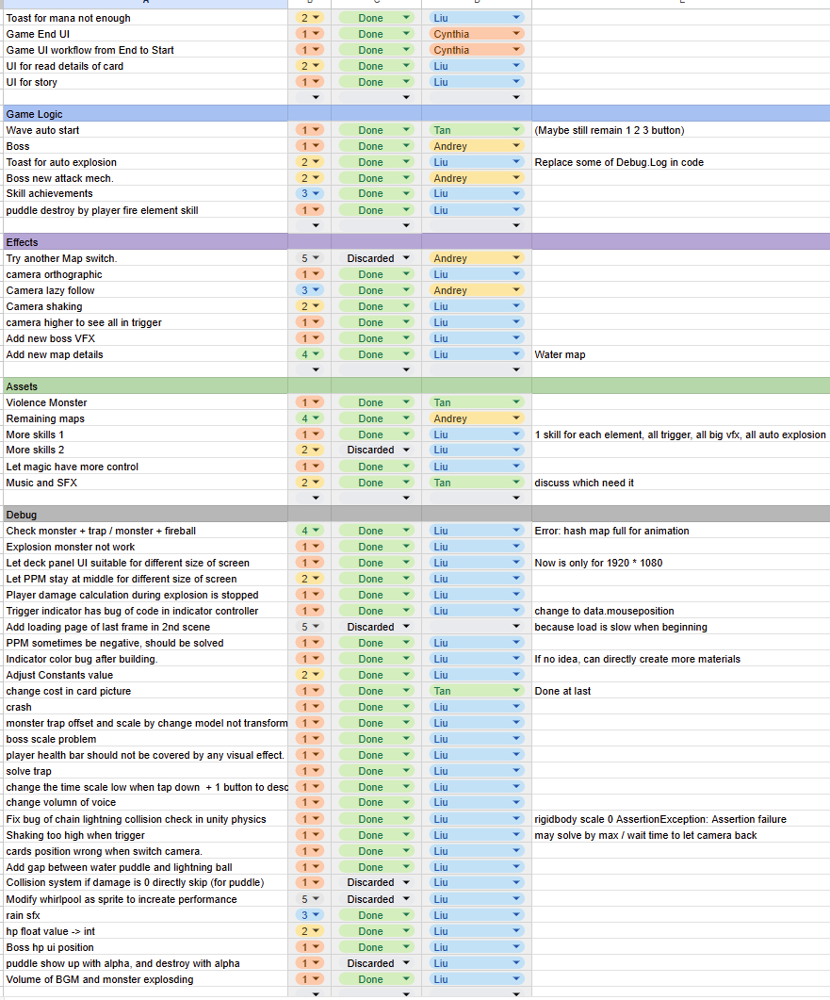
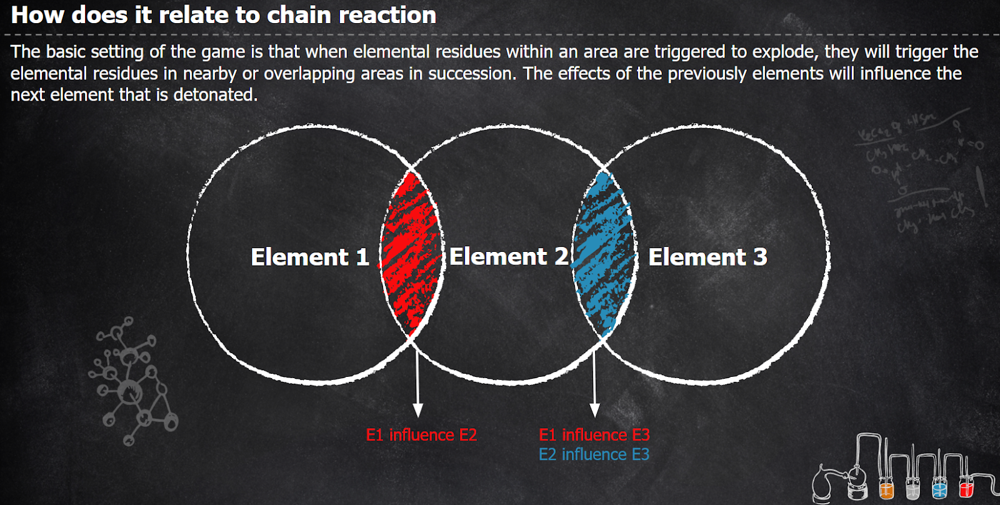

Play: [https://1drv.ms/u/c/b0b0825e23e53df9/EUGf6I8-GktHuT21pqaMgiAB3N4Pmtrfa5z9Q331IiAffA?e=2MG9a0](https://1drv.ms/u/c/b0b0825e23e53df9/EUGf6I8-GktHuT21pqaMgiAB3N4Pmtrfa5z9Q331IiAffA?e=2MG9a0)

## Technische Universität München

Game Laboratory theme: Chain Reaction

[Catalysm Cards - 灾害卡牌 Unity DOTS 作业主题Chain Reaction](https://www.bilibili.com/video/BV1dP9gYbEEn/)





我负责的部分：
* 项目任务分配和周期管理
* 技能系统，元素残留系统，Trigger系统，成就系统，Unity Physics的碰撞检测，动画，特效和shader，伤害显示，数值调整，修改和合并组员成果，

队友：
- 队友一：负责怪物系统、Wave系统、卡牌绘制、主菜单和SFX材料
- 队友二：负责地图、Boss系统和主角系统
- 队友三：负责Indicator和UI系统

## Winter Semester 2024/2025

Games Laboratory  
**─**

* Andrey Roytman

* Cynthia Drews

* Haorui Tan

* Yifei Liu

## 1. Game preview

  
Figure 1.1. Background story  
  
Figure 1.2. Skill achievement  
  
Figure 1.3. Main menu  
  
Figure 1.4. Deck design and monster tips between waves  
  
Figure 1.5. Combat   
  
Figure 1.6. Triggered skills  
Figure 1.7. Boss fight

## 1. New things for last milestone

## 

Figure 2.1 Kanban for last milestone

## 2. Chainreaction Theme

  
Figure 3.1. Game design relate to theme

## 3. Technical Reflection

### 1. System Design and Data Management:

**Centralized Data Structures:** Implemented centralized data structures like PendingDamage to allow cross-system access, improving modularity and reducing dependencies.

**Entity Configuration Grouping:** Organized entity configurations into system-specific groups with defined execution orders, ensuring clear and manageable workflows.

**Entity Destroy Handling:** Introduced a ShouldDestroy boolean flag to mark entities for destruction, ensuring destruction logic is deferred until all systems complete their operations. Centralized entities destroy logic within a single ISystem to prevent access conflicts and maintain consistency.

**Data Visit:** It should use EntityManager.GetComponentDataRW if we want to set value back. At the front part of our project, we use GetComponentData and SetComponentData which let some foreach loop in ECS hard to manage the values. The Race Condition usually causes errors and lets the build crash, we hard to fix that at later part.

### 2. Performance Optimization:

**Burst Compiler:** It not only makes the compiling progress faster, also makes the game run faster. For debugging easily, we comment all \[BurstCompile\] attributes. It led us to forget some limitations in the Burst Compiler. A major oversight was directly accessing Mono singletons within ISystem sometimes, which caused issues with Burst compatibility. We should create entities in Mono first and letting ISystem process them would have been a cleaner and more efficient approach. We use it in some parts, and laziness makes us use singleton in some parts.

### 3. VFX

We need to write or modify many shaders to make it work in DOTS and can use material override.

### 4. Debug

When using the official Unity package and package assets even popular in the market, we should trust what we analyse in the debug. They have some bugs or space to improve when we implement our code. For example, the Rukhanka package for animation in DOTS cannot hold up too many things in one frame, we should dynamically extend the Native container in the source code.

## 4. Discussions

### 1. What was the biggest technical difficulty during the project?

We had a very packed timeline. The start was slow because due to past experiences we decided to make the framework (DOTS/ECS) stable and only then to start adding content. Without any experience in DOTS, we need to design the framework of different features in the game with ECS to make the code framework can be **easily extended** in the future and **easily used by team members**, such as skill system, residue system, tag system, collision system. It took time to learn how to use ECS and write code in a new programming design, but after that we got a hang of it and implemented most of the features.

### 2. What was our impression of working with the theme?

### 3. Do you think the theme enhanced your game, or would you have been happier with total freedom?

It was motivating to work towards a specific theme and still left a lot of room for creativity. A wide variety of games made in this course is a clear confirmation for that.

After we settled down with the idea it was easy to develop it further. During the initial design phase, the initial idea and the theme kept us focused and prevented us from implementing features unnecessary or even harmful to the core of the design.

Having a specific game theme gave us a good direction of what to create and get some common ground for the brainstorm session. Total freedom would’ve given us too many options and it would’ve been harder to decide on game ideas. We believe that other teams already had some ideas that they wanted to force into their game, but it was difficult to turn them into reality.

### 4. What would we do differently in a next game project?

One of the inconveniences was related to code sharing. It should have been managed with more caution to avoid unnecessary issues when pulling the code. But at the end of the day we managed to merge all the code successfully without any major delays.

### 5. What was our greatest success during the project?

Being able to make the individual parts work together. The teamwork is the best we had during our time at university so far. The regular checkup meetings really helped to get things done in order. Communication was very good and everyone's capacity was considered when planning the next session and distributing the workload.

### 6. Are we happy with the final result of our project?

Yes, very happy\! We got some nice visuals and we like our gameplay a lot. We're looking forward to adding some more skills and mechanics, if we decide to continue working on the project.

Overall the whole process felt like a long game jam in a lot of ways, but made the process more complex and closer to real-life indie-development circumstances, when it's not enough to publish a hastily coded prototype.

### 7. Do we consider the project a success?

Our game is distinguished by significant technical achievements and extensive scope and writing. Our relentless efforts have allowed us to implement many ambitious features. We use advanced programming technology (ECS) to develop visually appealing skill effects and combinations, and blend game genres in new and engaging ways.

Although it took a lot of time for us to lay the initial groundwork, we managed to implement nearly all of the planned features, and we consider our game a success.

### 8. To what extent did we meet our project plan and milestones (not at all, partly, mostly, always)?

Mostly, especially during the holiday season it was hard to meet the milestones, but we managed to do the things which we wanted to achieve.

The project structure was generally good, but some parts felt a bit prolonged. For the most part brainstorming, prototyping and playtesting have been given too much time. They can easily be done in a week with a bit of groundwork like the information we got from the supervisor’s presentations. Those helped us to approach the project milestones in general. The rest of the time can be used for improving the actual game, which most teams probably have done anyway.

### 9. What improvements would we suggest for the course organization?

Maybe it would be beneficial to include some feedback from supervisors, individually for each team or in some other manner, maybe to share some experiences they witnessed during previous GameLab courses they mentored.

Also it would be nice to get more feedback during the semester, not only in the beginning from other team members.

It would be nice if the supervisors made it clear that some ideas need to have some features greatly changed to meet the expectations for the theme of the current course. Some teams seemed to be stuck at some features and minor issues that were not leading towards enjoyable gameplay and a satisfiable end result.

## 5. Team management Retrospective

### 1. Code Style and Standards:

While issues like code style consistency are generally considered routine and not worth highlighting in this report, Unity's official coding standards are notably detailed and sometimes irregular. For example, the naming conventions for private variables, static variables, and private static variables can vary without a clear pattern. To avoid confusion and ensure uniformity, it is highly recommended to adopt a unified IDE or plugin to enforce consistent coding practices across the team. 

The good thing is we use namespace for the code of different folders and manage folders as team members’ names.

### 2. Importance of Timely Code Reviews:

Regular code reviews for teammates' work are essential for the following reasons:

1. **Skill Discrepancies in Level or Aspect:** Differences in skill levels or aspects among team members can lead to redundant code functionality, either within an individual's work or between two collaborators. This may also result in the use of high-overhead code or APIs or component usage that negatively impact performance.  
2. **Logic and Functionality Overlaps:** Without proper reviews, duplicate logic or functionality may emerge, making it difficult to integrate or reconcile different parts of the codebase.  
3. **Integration Challenges:** Some code may not account for how teammates will connect or interact with it. Timely feedback during reviews can help identify and address these issues early.

### 3. Workload Distribution During Merging:

During this collaboration, the merging process was handled primarily by one person, resulting in a not good workflow. To improve efficiency, after conducting code reviews, the team should assess each member's strengths and divide the merging tasks more evenly based on expertise.

### 4. Enhancing Sub-Team Collaboration:

While the general team collaboration was good, there was a lack of sub-team cooperation. For example, certain features involved overlapping responsibilities between teammates A and B, yet all discussions took place in full-team meetings. It causes some redundant code, difficulty in merging, and unnecessary waiting for one person to complete their part.

## 6. Conclusion

This semester, our team successfully created a fun and comprehensive game. Despite encountering some challenges along the way, the experience proved to be both enjoyable and rewarding. Working on milestones and having features prepared at each phase made the development process engaging. With the final issues now resolved, we believe the game is ready for release and will provide an enjoyable experience for players. Additionally, there are opportunities to enhance the game further with potential future features like additional cards, long-term progression systems, and other exciting elements.