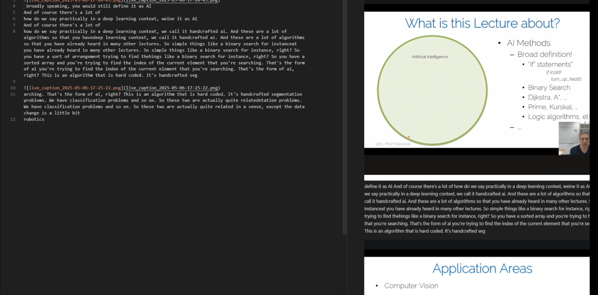

1. Extract the live caption by win11 features.
2. Self choose the area to screenshot.
3. Screenshot the ppt when it changes.
4. Save in markdown file.

[https://github.com/DuGuYifei/LectureHelper_win11/releases](https://github.com/DuGuYifei/LectureHelper_win11/releases)

