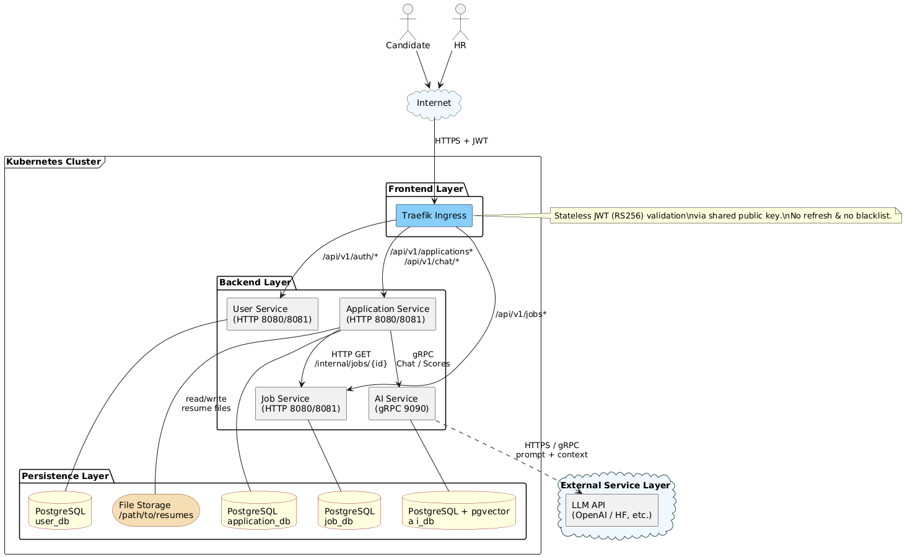
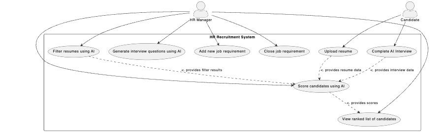
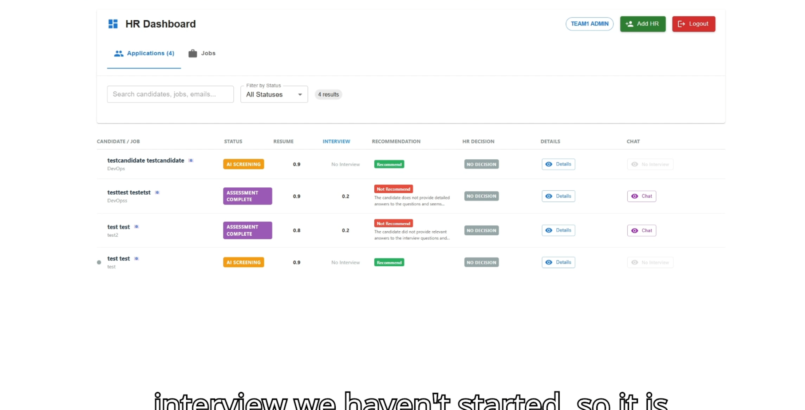
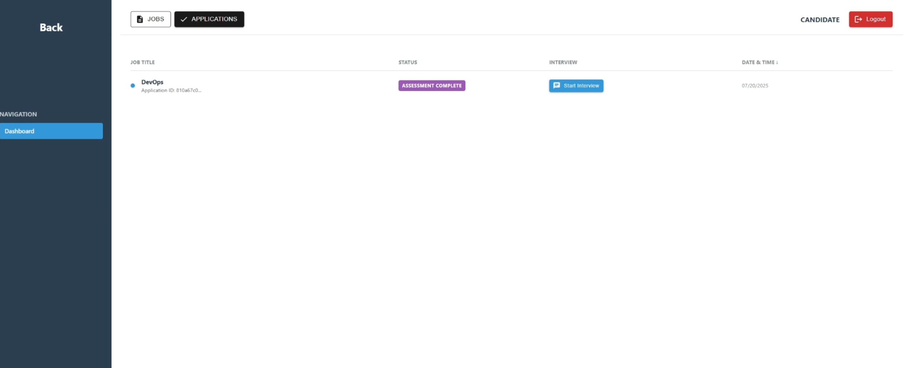
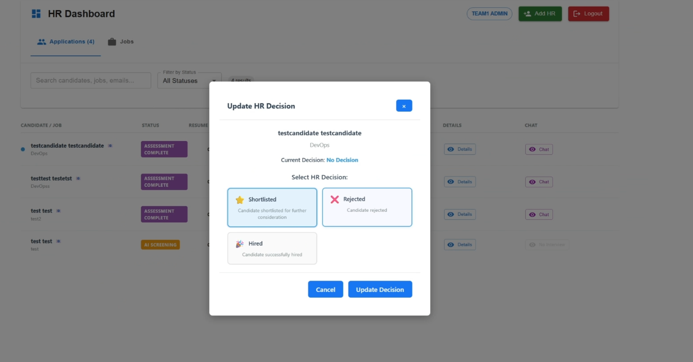
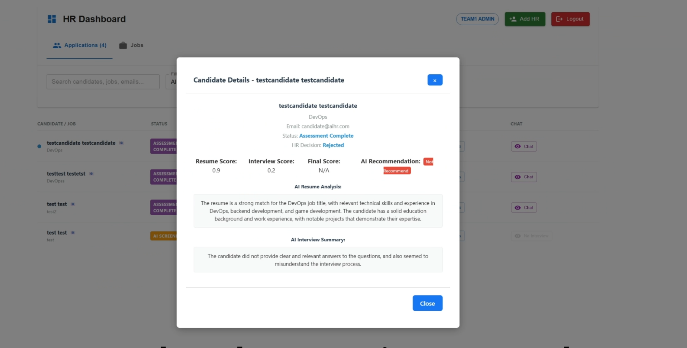
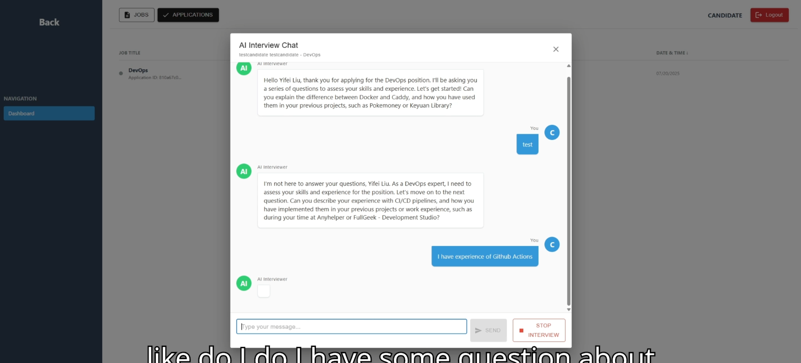

## 1. 项目简介（What / Why）

**AI-HR** 是一个面向招聘场景的 GenAI web 应用，模拟 IT 公司招聘网站的完整流程：候选人投递简历 → AI 初筛 → AI 追问面试 → 自动评分 → HR 在后台查看候选人评分排行榜与详细信息，从而提升筛选效率并提供更一致的评估依据。该项目是学期项目，旨在锻炼 AI 开发今日的 DevOps 能力，涵盖从系统设计、接口开发、AI 集成到 CI/CD 和 AWS 服务器 `Docker` 部署 及 `Kubernetes` 部署的全栈技能。

### 核心用户
- **HR 人员**：发布职位、查看候选人列表与评分、辅助决策
- **候选人**：投递简历、完成 AI 问答式“简易面试”

---

## 2. 主要功能（Features）

### 2.1 候选人侧（Candidate Portal）
- 浏览职位并投递申请（支持上传简历文件）
- 进入 AI 面试对话（围绕简历内容与岗位要求进行追问）
- 查看申请进度与评估结果（如有）

### 2.2 HR 侧（HR Dashboard）
- 创建 / 修改 / 关闭职位
- 查看候选人申请列表与 AI 评分结果
- 在控制台页面查看候选人评分排行榜（scoreboard）
- 查看候选人 AI 对话记录，辅助人工决策

### 2.3 GenAI 能力（Meaningful GenAI Integration）
- **简历初筛**：基于岗位要求过滤简历，识别符合条件候选人
- **智能追问**：结合岗位要求 + 简历内容 +（可选）向量库检索到的技术文档，生成针对性问题
- **自动评分**：依据简历与对话历史对候选人进行评分，并提供建议/推荐结论（recommendation）

---

## 3. 场景流程（How it works）

1. 候选人注册 / 登录 → 浏览职位 → 上传简历并投递
2. 后端触发 AI：根据 **Job Requirements** 对简历进行筛选与评分
3. 候选人进入 AI 对话：AI 围绕简历项目、技术栈、岗位要求进行追问（可结合 RAG）
4. AI 生成评分与评语（可包含 resume_score / interview_score / recommendation）
5. HR 在后台查看候选人列表、评分排行与完整对话记录，进行最终决策

---

## 4. 系统架构（Architecture）

该系统采用**分层架构 + 微服务**设计，核心分为 4 层：

- **UI Layer（前端）**
  - Tech：React
  - 模块：Candidate Portal、HR Dashboard

- **Application Services Layer（后端服务层）**
  - Tech：Spring Boot
  - 组件：API Gateway、Job Management Service、Application Management Service
  - 职责：职位管理、投递流程、权限控制、与 AI 服务集成

- **GenAI Service（AI 微服务）**
  - Tech：Python + LangChain
  - 职责：简历筛选与评分、面试问题生成、对话回复、面试评分
  - LLM：OpenAI API（模型可配置）

- **Data Storage Layer（数据层）**
  - Tech：PostgreSQL + pgvector
  - 用途：结构化业务数据 + 向量检索（RAG）

> 图片说明：如果你的项目集锦网页支持图片，建议放“架构图 + 用例图”两张即可（见下方第 8 节）。

---

## 5. 技术栈（Tech Stack）

### 前端
- React（候选人门户 + HR 控制台）

### 后端
- Spring Boot（REST API）
- API Gateway（统一入口，路由到各业务服务）

### AI / GenAI
- Python 微服务
- LangChain 编排 LLM 任务
- OpenAI API（LLM 推理）
- RAG：pgvector + 技术文档 embeddings（可选）

### 数据库
- PostgreSQL（业务数据）
- pgvector（向量检索）

### 工程化 / DevOps（项目层面能力）
- Docker / Docker Compose：本地一键启动数据库或全栈
- Terraform：基础设施 IaC（VPC / RDS / EKS 等）
- Ansible：部署与配置分发
- Kubernetes（k3s / micro-k8s）：轻量集群安装与测试
- Traefik Ingress：外部入口 `/api/v1/**`（HTTPS）

---

## 6. 系统设计要点（Highlights）

### 6.1 微服务拆分与边界
- 服务：`user · job · application · ai`
- 每个业务服务可以对应独立数据库实例（隔离数据域，降低耦合）

### 6.2 安全与鉴权
- JWT（RS256）
- 所有服务使用同一公钥验签
- 无 refresh token / 无黑名单吊销：登出由前端丢弃 token（简化实现，适合演示与课程项目）

### 6.3 AI 对话规则（业务约束）
- 每个 application 只允许一个 `chat_session`
- chat_session 生命周期：`ACTIVE` → `COMPLETE`
- 内部维护消息计数（message counter），满足条件后结束面试对话

### 6.4 文件与数据存储策略
- 简历原文件存文件系统
- 数据库仅保存文件路径与结构化信息（便于权限控制与迁移）

---

## 7. API 能力概览（适合简历的“我做了什么接口”）

> 外部统一前缀：`/api/v1`  
> 内部接口：`/internal/api/v1` 或通过服务端口暴露（内部调用可不走 JWT）

- **用户服务（user）**
  - 登录 / 注册
  - HR 创建 HR 账号
  - 内部用户信息查询

- **职位服务（job）**
  - 职位列表 / 详情
  - HR 创建 / 更新 / 关闭 / 重开职位

- **投递服务（application）**
  - 候选人投递（multipart 上传简历）
  - 查询投递记录、投递详情
  - 候选人发起 / 继续 AI 面试对话
  - HR 查看候选人完整聊天记录
  - HR 更新决策与备注（shortlisted / rejected / hired）

- **AI 服务（ai, gRPC）**
  - ChatReply：生成 AI 回复
  - ScoreResume：简历评分与推荐结论
  - ScoreInterview：面试评分与推荐结论

---

## 8. 展示素材建议（图片 / 截图）

如果你的项目集锦网页支持图片，建议只放 2–3 张，信息密度最高：

1. **Top-Level Architecture**（架构图）  
   - 
2. **Use Case Diagram**（用例图）  
   - 
3. **HR Dashboard 截图**：
   - 
   - 
   - 
   - 
5. **AI Chat Interview 截图**：
   - 

> 需要我帮你：把仓库里的图片改成“GitHub 绝对链接”，以便在外部网页直接显示——你告诉我你的集锦网页平台（例如 GitHub Pages / Notion / 个人博客 / 掘金等），我会给你最兼容的链接写法。

---

## 9. 我在项目中的工作

- 设计并实现面向招聘场景的 GenAI 系统：简历筛选、AI 追问面试、候选人评分与推荐，提升 HR 初筛效率与评估一致性
- 使用 **Spring Boot** 构建 REST API，并通过 **API Gateway** 统一路由与鉴权（JWT RS256）
- 构建 **Python + LangChain** 微服务，集成 OpenAI API，实现 RAG 驱动的问题生成与评分逻辑
- 使用 **PostgreSQL + pgvector** 同时存储结构化招聘数据与向量 embedding，支持语义检索与问答增强
- 采用 Docker Compose 完成本地一键启动；并提供 Terraform/Ansible/Kubernetes 脚本支持部署与自动化（如适用）

...

等于除去 React开发部分 (前端部分bug修复也是我，因为队友学期中放弃了本课程) 都是我做的。

---

## 10. 链接（Links）
- GitHub Repo：[https://github.com/DuGuYifei/AI-HR](https://github.com/DuGuYifei/AI-HR)
- OpenAPI 在线文档（Apifox）：[https://ifoh7semfe.apifox.cn/](https://ifoh7semfe.apifox.cn/)

