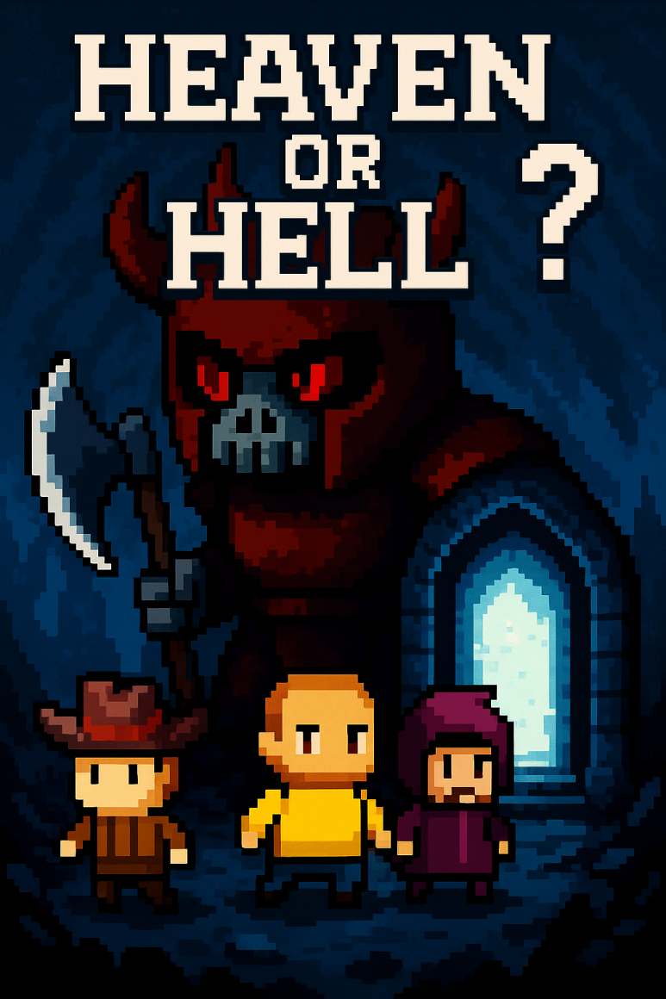

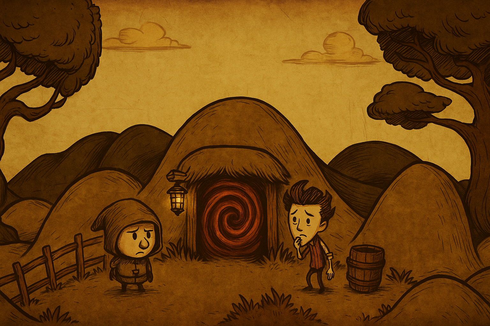

Play: [Download Game and server and server toggle helper](https://1drv.ms/f/c/b0b0825e23e53df9/EqJYmfhTV-pJp_jWkuNdRhsBcHDd9MYtrX31vIsY41K9fQ?e=ksJlZG)

## Heaven or Hell[^1] {#heaven-or-hell}
[Heaven-or-Hell 非对称竞技 多人在线 Unity客户端 基于KCP协议自写C++服务器](https://www.bilibili.com/video/BV1uDsgzxErS/)



在线非对称竞技，服务器包含房间系统，tick系统，使用kcp协议传输，google的Protobuf包装内容。

我负责的部分：
* 项目任务分配和周期管理
* 架构设计，服务器开发，protobuf设计，客户端的部分功能

## 

Topic: Road To Nowhere  
Team: ANT MILL

* Andrey Roytman  
* Sina Bolouki  
* Yifei Liu

## Milestone 1: Game idea pitch {#milestone-1:-game-idea-pitch}

### 1\. Description {#1.-description}

#### Brief game description {#brief-game-description}

Heaven of Hell is a top-down 2D PVP multiplayer game with asymmetric design, where a team of players as lost souls is trying to escape from their only enemy — the reaper that is willing to bring them all down in Hell.   
The game is set in a maze-like location, and a number of gates are scattered across the map. Each gate leads to hell or heaven. Initially players do not know where specifically each gate leads, so they have to check it by themselves. If the player enters the heaven gate, they escape, but if the player enters a hell gate, they have to fight to come back to the level through a little runner game. (Backup idea: or choose to become the dog soul of the reaper,  to help the reaper to see the trace of other souls when the reaper moves with the dog.)  
The reaper can weaken souls by hitting them, and in order to survive, other souls have to help it gain its power again to be able to escape.

#### Win conditions {#win-conditions}

- No more than one escapes — the reaper wins.  
- Two souls escape — tie.  
- More than Two soul escapes — souls win.

#### Pre-game lobby {#pre-game-lobby}

In the game lobby, before the game starts, players are initially in a choosing state: they chose no role yet.  
There can be only one reaper and only one soul of each class (this will be tested after implementation), so players move their avatars to a specific role slot by clicking the slot.  
When everyone chooses their role and presses "ready", the game begins.

#### Abilities {#abilities}

##### Souls {#souls}

Soul-players have 360° view, movement is controlled by arrows or WASD keys.   
There are three types of souls available for play:

- The Dog: every soul leaves a trail of steps, and they are visible for The Dog class so they can track teammates fast. These trails do not stay forever and gradually fade.  
- The Psychologist: once in a game can check whether the gate they found leads to hell or to heaven before entering it. When Psychologist checks a gate, in its perspective it turns into red or white to indicate where it leads.  
- The Detective: can see a general direction for all (or alternatively for only the closest) gates. Directing arrows appear on the screen at a specific distance from the center of the display and rotate around this center to indicate a specific direction.

##### Reaper {#reaper}

Reaper's abilities:

- Sight is limited and controlled by a mouse.  
- Movement is controlled similarly to Souls. Speed is faster than souls.  
- Reaper has a minimap where they can see the outline of the level and positions of gates.  
- High senses ability allows the reaper to see in which direction a soul is, if it is relatively close to the reaper (similar to The Detective). Direction indicators appear briefly once in 5-10 seconds.  
- Attack: the reaper can hit a soul. If the attack collides with a soul, the reaper is slowed down or rooted and cannot attack for several seconds (approximately 5 seconds).

#### One-time abilities {#one-time-abilities}

Souls can use one-time abilities. They can be found on the level multiple times.

- Pseudo Soul: a distraction soul that looks close to a regular soul and is detected by the reaper's high senses ability. Destroyed on being hit once by the reaper. To place the Pseudo Soul, the player presses the ability button to enter placement mode, and places it right below the soul with clicking left mouse button, and cancels the placement by clicking right mouse button.  
- Soul Disguise: a soul can turn itself invisible for a short period of time. It is triggered immediately when the player presses the ability button.  
- Reaper trap: Souls place a circular trap. It is barely visible to the Reaper and it roots them for several seconds if they step on it. After being triggered, the trap is destroyed. To place a trap, the player presses the ability button to enter placement mode, and places it right below the soul with clicking left mouse button, and cancels the placement by clicking right mouse button.

#### Soul marking ability {#soul-marking-ability}

While on the level, souls can leave a limited amount of marks on the floor. It can be either red or white. Intended use: marking gates for other souls.   
When a soul-player wants to place a marker, they press and hold a respective (different for red and white mark) button to "spray" it on the floor. If they press movement buttons while in 'spray' state, they start moving and stop 'spraying'.

#### Health mechanics {#health-mechanics}

##### The Reaper {#the-reaper}

is immortal and can only be slowed down or rooted for a limited amount of time.

##### Soul {#soul}

has a health bar that decreases gradually when the soul is in a weakened state or is inside a hell gate.  
If the soul's health counter goes to zero, the soul is sent to hell instantly.  
If the soul is hit twice by the Reaper while in default state, its state changes to a weakened state. In the weakened state the soul can only move. To change a soul's state from weakened to default a weakened soul should go with another default-state soul at the altar.

##### Altar {#altar}

When two souls — weakened and default —  both go close enough to the altar (approximately a meter or less), it activates (indicated by its lighting up and a sound effect), and the default state soul should complete a mini-game to return power to the weakened state soul.  
In order to make it easier for souls to find the altar, if a soul is close enough (starting from approximately 15-20 meters) to the altar, it can hear the altar's sound effect that gets louder as the souls get closer to it.

#### Altar mini-game {#altar-mini-game}

When two souls (default and weakened) approach the altar, it activates and the default souls can start an altar mini-game with an interaction button.  
In the minigame, the default-soul player has to press the right sequence of direction buttons in order to change the weakened soul's state back to default.   
If the default-soul player completes the sequence without mistakes, the weakened-soul is transformed back into default state.  
If the default-soul player fails and types a wrong button at any stage, the sequence has to be entered from the beginning, and the altar on the reaper's mini-map briefly lights up.

#### Hell-gate mini-game {#hell-gate-mini-game}

If the player enters a hell-gate, the following happens:

- soul's model disappears from the level  
- the Hell-gate minigame starts:  
  - The player has to reach the exit before the soul's health goes below zero.  
  - The runner track is positioned along the camera view.   
  - The soul moves towards the camera.  
  - If it collides with burning obstacles, it is slowed down.  
  - If it collides with a speed booster object, it temporarily gains speed.  
  - When the soul reaches the exit of the track, it appears on the level again at the gate. 

#### Level {#level}

The map looks like an old abandoned mining site. Structurally, it is a randomly generated maze. Positions of gates (2 hell-gates and 2 heaven-gates), the altar and one-time abilities (each ability is spawned multiple times) are also generated randomly.

#### Storyline background {#storyline-background}

An abandoned mining site, where all exits are replaced with hell or heaven gates so souls cannot escape and keep haunting the earth.

#### Theme correlation with the design {#theme-correlation-with-the-design}

The most important game mechanics can become an interpretation of a road to nowhere.   
The whole souls game cycle can be viewed as a layered road that can possibly lead to nowhere.

- On the level layer, there will certainly be multiple instances when they come to a dead end or choose to enter a hell-gate. They reached nowhere.  
- On the hell-gate layer, souls have to struggle and fight, but it is probable that their health will go out before they escape and they will stay there, behind the hell-gate, in nowhere.  
- In a weakened-state, a soul has to make her way to the altar, and in a sense it is parallel to the exiting the hell-gate, both are time-limited, but in this case a soul has to navigate to the altar with another team-mate to the right place, without letting the reaper catch the default-soul.

The reaper's perspective also possesses a path that leads to nowhere, if souls use one-time abilities wisely.  
The reaper can be tricked by souls with their one-time abilities and led into a dead end or just an empty location with no actual souls. So even though they have a map of the level, they still can end up empty handed if they fail to catch souls. In their search they ended up nowhere close to the completion of the mission.	

#### Visuals {#visuals}

Visually, the game is set in a sketchy cartoon style.  
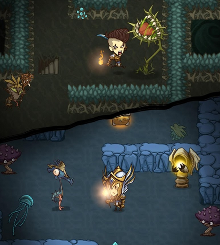  
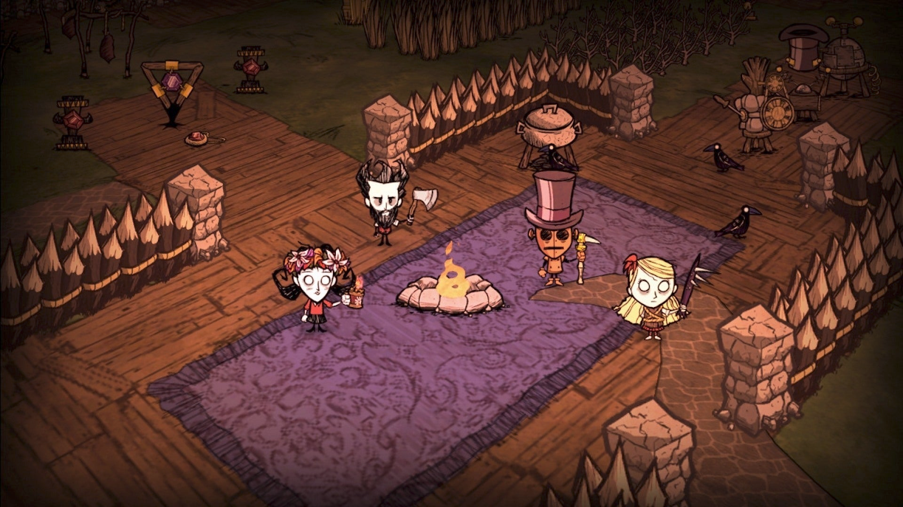

##### References {#references}

Reaper limited sight reference:  
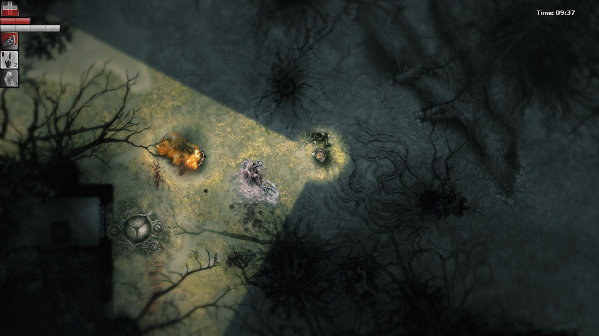  
The Dog ability reference:  
  
The Detective ability reference:  
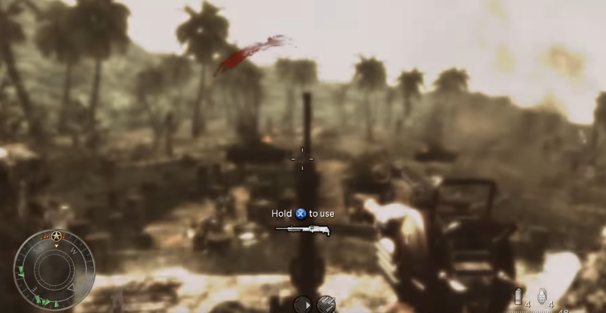  
Altar mini-game reference:  
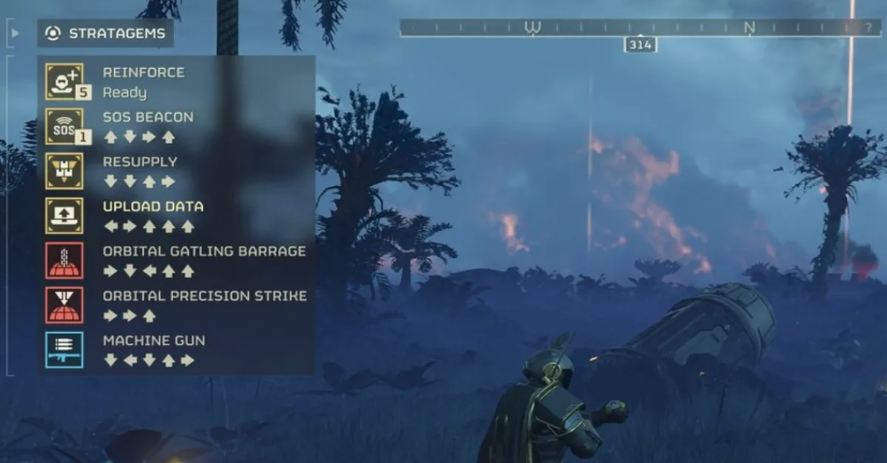  
Hell-gate mini-gate reference:  
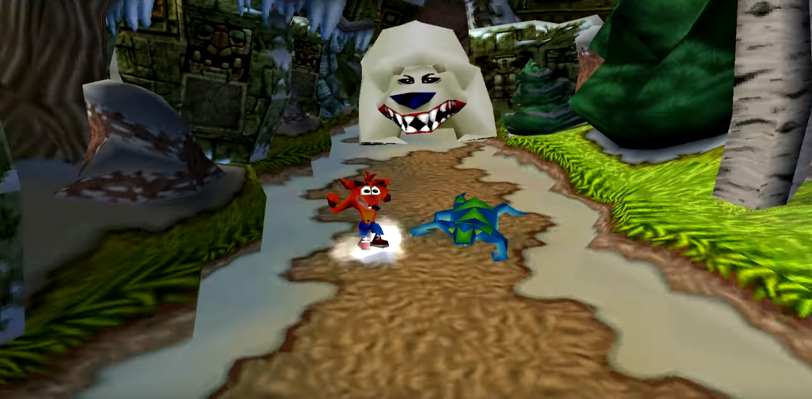  
Altar reference:  
 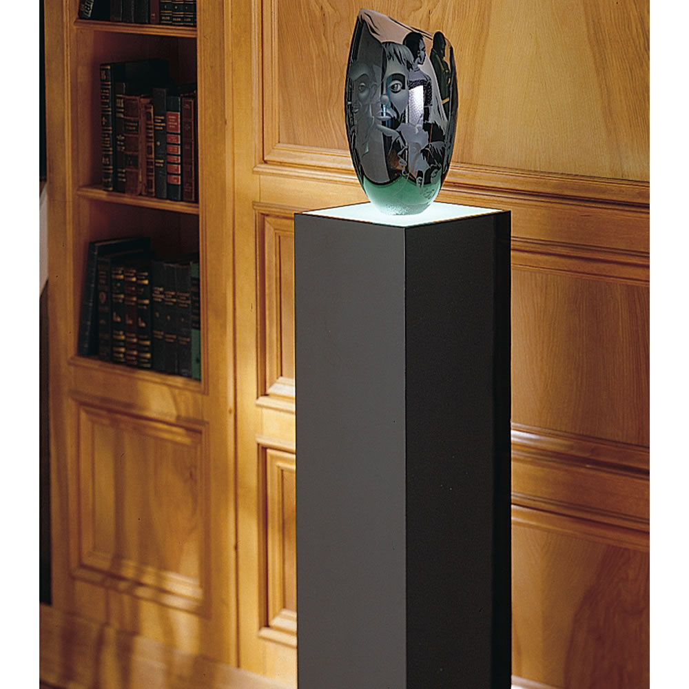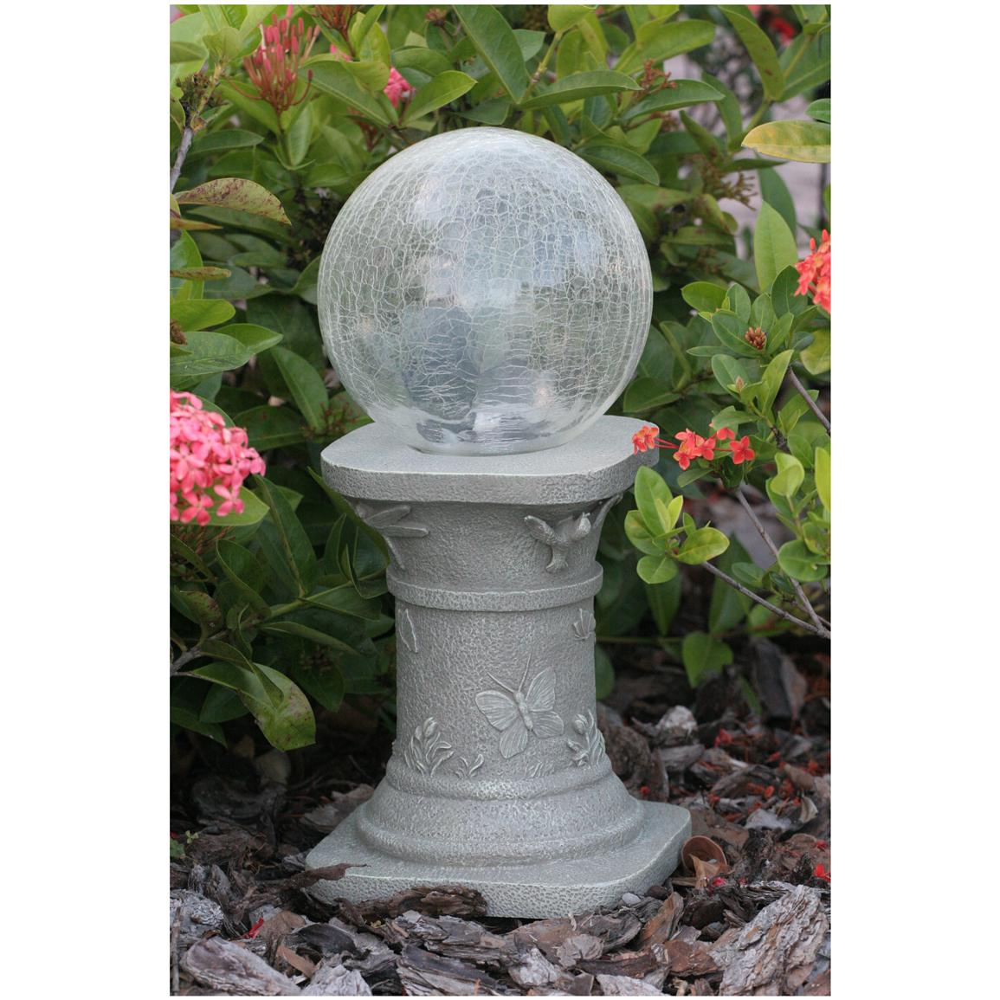

### 2\. Backup Idea {#2.-backup-idea}

1. We may need to create one more reaper or give reapers some ability to balance the game.  
2. Add some traps/mechanisms to the map.

### 3\. Technological Bull's-eye {#3.-technological-bull's-eye}

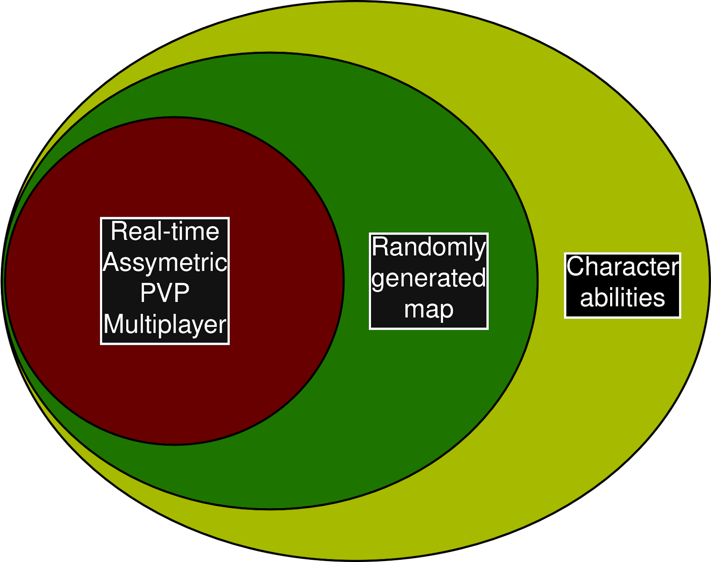  
Achieving a consistent real-time asymmetric multiplayer is a central pillar of the game. All other features will be built up from the multiplayer setup.

Next in priority is a map generator that makes coherent levels that will not feel random or too hard to navigate for both sides.

And finally, characters' abilities will be implemented and balanced to match the feel of the right map size and characters' parameters.

### 4\. Technical Aspects {#4.-technical-aspects}

#### Game Engine {#game-engine}

We chose Unity (version 6.0) as the game engine based on these parameters:

- Previous knowledge: All members of our team had previously created games using Unity. This will remove the time needed to learn the basics of using a new game engine from our timeline, enabling us to focus on developing more advanced features on the game  
- Learning material availability: There is a big community of developers using Unity to create games. Therefore, lots of material can be found covering different aspects of development.  
- Cross-platform support: We can build our game for different operating systems using Unity’s build tools with little to no effort.

#### Multiplayer {#multiplayer}

We had two options for developing the multiplayer features of the game:

1. Unity’s multiplayer services: a pre-built suite of systems that creates a level of abstraction over networking infrastructure, removing developer’s control over some aspects of the multiplayer features.  
2. Developing our own multiplayer systems: This will give us more access to design and development of the systems, which gives us lots of room to increase the efficiency of the system.

We temporarily prefer the second option due to two reasons. First, this option will enable us to create a more efficient network system. Secondly, this will give the team the opportunity to further increase their knowledge in game multiplayer by having a full hands-on experience on the different aspects of multiplayer game development.

##### Multiplayer Architecture and Technologies {#multiplayer-architecture-and-technologies}

We develop a server-client architecture where one of the players acts as the game server and the other players connect to this player and act as clients. Ideally, the server should manage all the logic of the game while the clients only send their input to the server and show the current state of the game according to the data they receive from the server.

There are several networking technologies available for the multiplayer systems of the game. We initially chose KCP as they create a persistent bi-directional channel between the server and the clients, enabling persistent transport of real-time data and fast.

#### Randomly-Generated Map {#randomly-generated-map}

We create a generation system for our map. The generated map should satisfy all the requirements from the game design while ensuring a balanced encounter between the players. The generation system will improve the replayability of the game, as each round of play will feel unique.

At the same time, we need to consider how to make all clients have the same map.

### 5\. Schedule with Timeline {#5.-schedule-with-timeline}

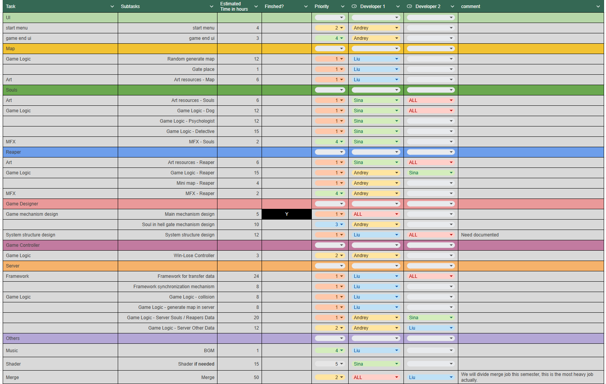

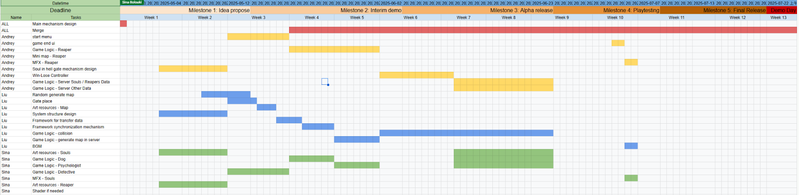

## Milestone 2: Interim Demo {#milestone-2:-interim-demo}

### 1\. Progress overview {#1.-progress-overview}

At the moment the game consists of three separate prototypes:

1. Custom Server,  
2. Client Unity Side,  
3. Mini-games.

Each prototype is developed and tested separately before it can be brought together and then tested in its completeness.

### 2\. Custom Multiplayer Game Server Architecture {#2.-custom-multiplayer-game-server-architecture}

#### 2.1. Server Architecture {#2.1.-server-architecture}

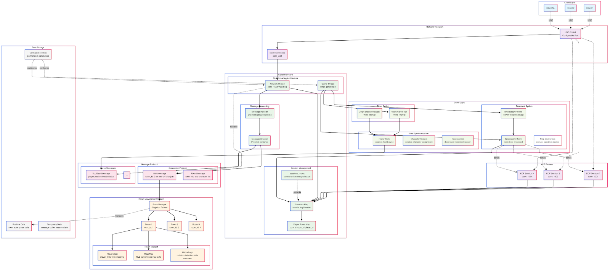  
For big picture link: [Server Architecture Image](https://raw.githubusercontent.com/DuGuYifei/HeavenOrHell/7f79f4db16f5a5e5e74b39add11828fbaf0691ea/img/server.svg)

1. **Networking**  
   * **Protocols**: Clients connect to the server using UDP. The server implements KCP (same as Mirror) for reliable, low-latency transport over UDP.  
   * **epoll**: High-performance event loop using epoll for efficient concurrent connection handling.  
2. **Session and Data Protocols**  
   * **KcpSession**: Each client gets a dedicated KCP session (`conv`). All sessions are managed centrally.  
   * **Protocol Buffers**: Messages are serialized with Protocol Buffers for efficient, cross-platform communication.  
3. **Server Core (Multi-threaded)**  
   * **Network Thread**: Handles epoll events, KCP packet processing, and message dispatching.  
   * **Game Logic Thread**: Runs the main game loop at 60 FPS, handling room logic and gameplay.  
   * **Thread Safety**: Critical data structures (sessions map, player-room map) are protected by mutexes for safe concurrent access.  
4. **Room System**  
   * **RoomManager**: Singleton managing all game rooms. Supports dynamic player join/leave.  
   * **Room Content**: Each room contains a player list, compressed map data (RLE), and independent logic for collision, skills, cooldowns, etc.  
5. **Tick and Broadcast System**  
   * **Timers**: 60Hz tick for core game logic; 20Hz tick for state broadcasting.  
   * **Broadcast**: Supports room-level and global broadcasts, with an exclusion mechanism for selective sync (e.g., skipping sender).  
6. **Messaging & State Sync**  
   * **Connection Protocols**: `HelloMessage` for new/join room, `RoomMessage` for room/character info.  
   * **Game Messages**: E.g., `SoulBasicMessage` for player state (position, health, etc).  
   * **Reconnection Support**: Handles disconnects and allows seamless player reconnection.  
7. **Data Storage & Configuration**  
   * **Config Data**: Ports, timeouts, and parameters are centrally configured.  
   * **Runtime Data**: Active room and player states are maintained in-memory.  
   * **Temporary Data**: Message buffers and transient session data.

#### 2.2. Handshake {#2.2.-handshake}

1. Start with UDP:  
   1.  0 is in the first byte which is the position of the conversation id of kcp.  
   2. Room id after that  
2. Server will know if it is newcomer when extract conversation id  
   1. If room id is 0 then player want to create new room  
   2. if not, try to find the room  
3. Server reply kcp message with new conversation id  
* this message is RoomMessage

message Character {  
   int32 player\_id \= 1;  
   CharacterType character\_type \= 2;  
}  
message RoomMessage {  
   bool is\_join \= 1;  
   int32 room\_id \= 2;  
   int32 player\_id \= 3;  
   repeated Character characters \= 4;  
}

* followed by a MazeMapMessage \- RLE map information in string

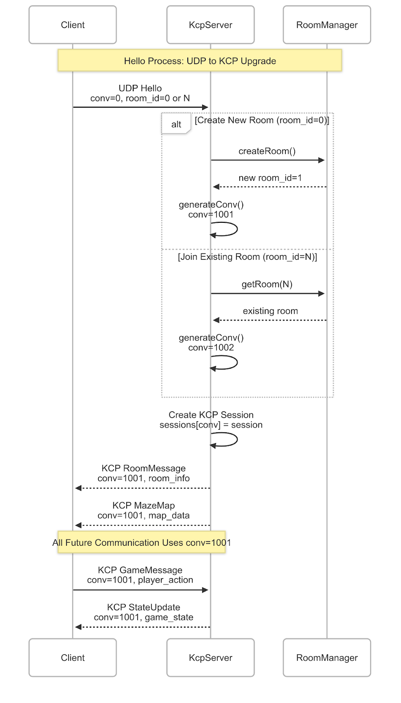

#### 2.3. Map Generation {#2.3.-map-generation}

1. **RLE Compression:**  
   The map data is stored using Run-Length Encoding (RLE) for efficient compression and transmission.

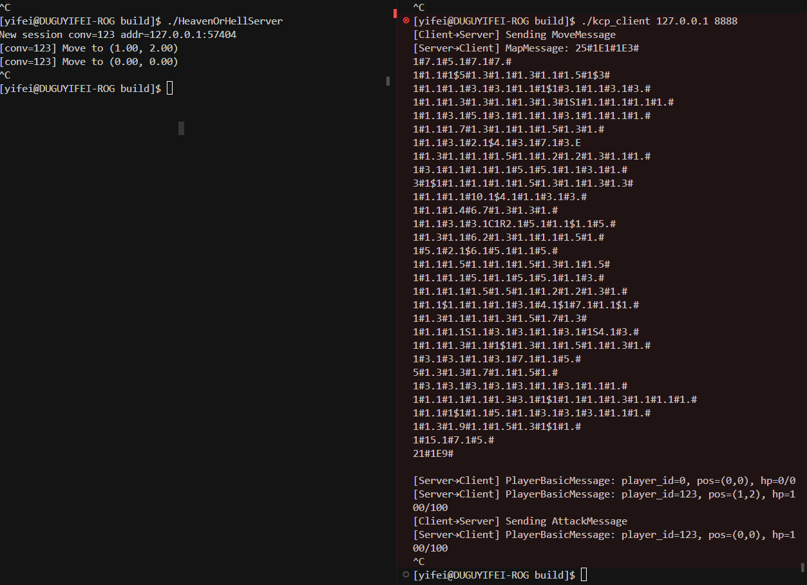

2. **Random Generation:**  
   Each map is procedurally generated to ensure unique layouts for every game session.  
* **Gates Placement:**  
  Four gates are placed on the edges of the map, one on each side.  
* **Altar Placement:**  
  A single altar is positioned along the central axis, randomly placed between 1/4 and 3/4 of the map’s length.  
* **Path Generation (DFS):**  
  Paths are generated from each gate to the altar using Depth-First Search (DFS), ensuring that all gates are connected to the altar.  
* **Altar Area Clearing:**  
  The area surrounding the altar is cleared to provide enough space for player activities and events.  
* **Wall Removal for Rings:**  
  Additional walls are selectively removed based on specific rules to create more circular paths (“rings”) within the maze for enhanced gameplay dynamics.

### 2\. Client Unity side {#2.-client-unity-side}

Before starting the work on the prototype, we first had to select our character and environment assets. Our criteria included both aesthetic considerations and fitting together with the other assets. With these criteria in mind. We selected a dungeon tile map and a character pack from Unity Asset Store. 

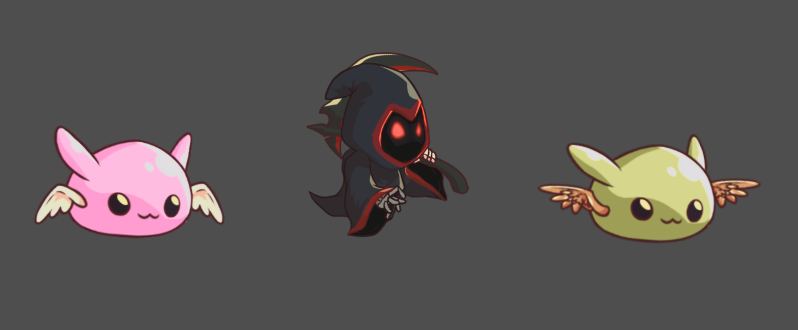

In our next step we created the map in the Game Engine from the data sent from the server. We used Unity’s tilemaps and RuleTiles in this part of the game:  
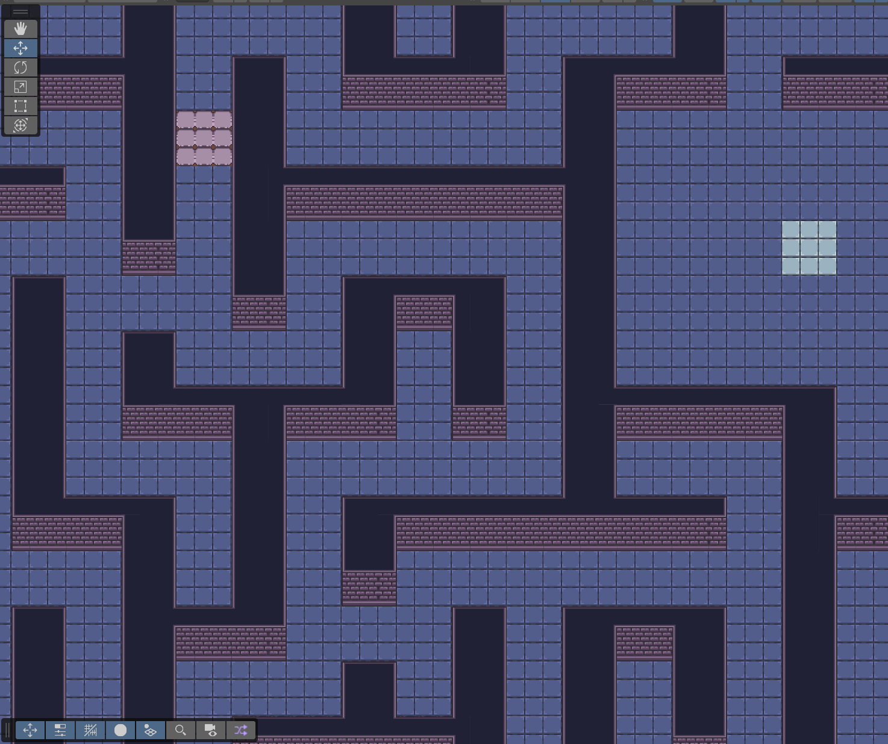  
Then we developed the movement controllers for the player. We also created a 2d lighting system that both limits players visible area (Fog of War functionality) and gives the spooky feeling that suits our game theme  
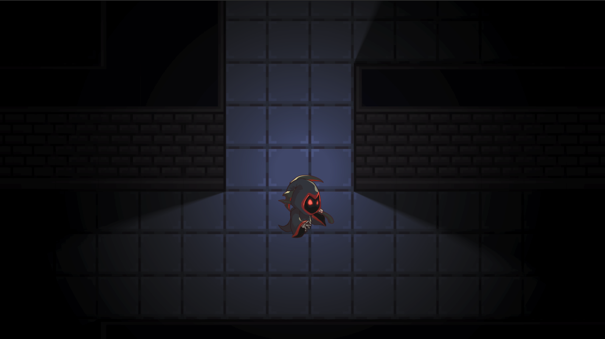

After testing the game with the mentioned developed sections, we found out about the importance of the positions of the gates in the map. Initially, the gates were placed at the edges of the map. But that would make the players avoid the center parts of the map to increase their chances of finding the gate. We then decided to spawn the ghosts in spawn points nearer to the center and also have the gates inside the map and not on the edges.

### 3\. Mini-games {#3.-mini-games}

#### 3.1. Altar mini-game {#3.1.-altar-mini-game}

The Alter mini-game is implemented and functional isolated from the main game.

In the mini-game,

- the player has to press a correct sequence of buttons to complete it, from left to right;  
- when the player presses the correct button, it is deleted, so the next button to press is visible (*green crosses and arrows* on the screenshot);  
- if the player presses the wrong button, the sequence is randomly generated again, and the player has to complete it again from the very beginning (*red cross and arrow* on the screenshot).

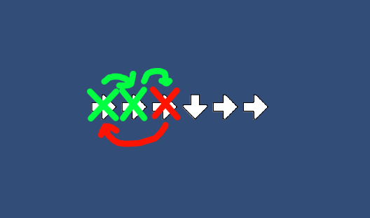

#### 3.2. Runner mini-game {#3.2.-runner-mini-game}

The Runner mini-game is implemented in its simple form, with no assets at the moment.

In the game,

- the Soul is moving along the straight path, and the camera is positioned in front of the Soul and views incoming obstacles and the Wall of Fire behind (*green arrows* on the screenshot);  
- the Wall of Fire is moving constantly behind the Souls with constant speed, equal to the Soul's movement speed (*red arrow* on the screenshot);  
- a player can move the Souls side-ways and jump (*blue arrows* on the screenshot) to avoid obstacles (*red lines* on the screenshot);  
- if the Soul touches any obstacle, it is slowed down for a brief moment that makes the distance between the Wall and the Souls shorter (*orange line* on the screenshot).

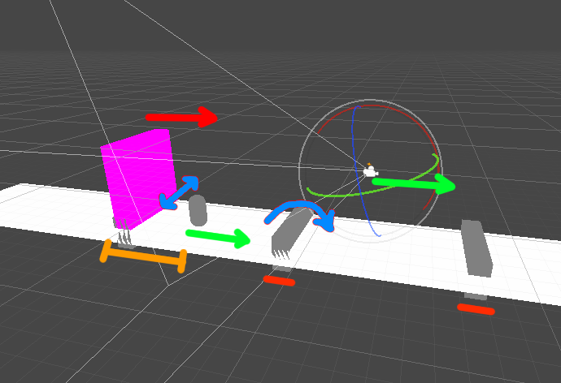

Next step will be making more obstacle variation by creating more different blocks that the runner level is built with, adding assets (e.g. Soul's and fire sprites, modelling the Hell's staircase) and integrating it into the whole game.

### 4\. Feedback {#4.-feedback}

#### 4.1. Balancing {#4.1.-balancing}

There were comments about balancing, and we agree that it is going to be a challenge in our development. At the moment we could not really test the main part of our game: how navigating the level feels both for Reaper and a Soul. We made our best design guesses for first online-tests, and we probably have to make more room for balancing every part of the game in our schedule.

#### 4.2. Server-client implementation {#4.2.-server-client-implementation}

A lot of feedback was about the implementation of the server-client code. Some of them suggested going with the Unity Multiplayer system, some mentioned nice learning potential for implementing our own back-end, and we decided to settle with writing our own server, including learning reasoning.

#### 4.3. Understanding of the concept {#4.3.-understanding-of-the-concept}

By the feedback it seems that the core idea of the game is communicated correctly (e.g. comparisons with Dead by Daylight and Don't Starve), and at the same time some useful feedback about balancing: we will definitely need to test and think more about win-lose conditions and design the game difficulty when the are some souls that escaped or were sent to Hell.

### 5\. Next steps {#5.-next-steps}

Next our goal will be to connect all prototypes into one prototype, so we can then test it, make more changes if needed, and start adding more meat to the project, i.e. implementing Souls' and Reaper's abilities, finding and making more assets, creating players' lobby etc.

## 

## Milestone 3: Alpha-Release {#milestone-3:-alpha-release}

### 1\. Overview {#1.-overview}

In this milestone we brought together everything we made so far and added much more features:

* We've developed server-client interaction further, making the interaction more complex.  
* Souls and Reaper characters now have their own special abilities.  
* Players can go all the way from the main menu to the gameplay.  
* The game now can actually be finished.

### 2\. Server update stuff {#2.-server-update-stuff}

* Similar design as [Server Architecture Image](https://raw.githubusercontent.com/DuGuYifei/HeavenOrHell/7f79f4db16f5a5e5e74b39add11828fbaf0691ea/img/server.svg)  
* Merge KCP session actions in one thread.  
* Use SPSC (Single Producer Single Consumer) free lock queue to transfer messages received to game logic to handle.  
* Player information stored in server:  
      int conv\_id;  
      Position position;  
      float hp;  
      float maxHp;  
      message::CharacterType character\_type;  
      message::PlayerAnimationType animation\_type;  
      message::CharacterState character\_state;  
      bool is\_ready;  
      float weak\_timer;  
      PlayerResult player\_result;  
    
  enum class PlayerResult  
  {  
      IN\_GAME \= 0,      
      DIE\_BY\_HIT \= 1,   
      HELL \= 2,         
      HEAVEN \= 3        
  };  
    
  enum PlayerAnimationType {  
    IDLE \= 0;  
    WALK\_LEFT \= 1;  
    WALK\_RIGHT \= 2;  
    DASH\_LEFT \= 3;  
    DASH\_RIGHT \= 4;  
    ATTACK \= 5;  
    HIT \= 6;  
    WEAK \= 7;  
    DIE \= 8;  
  }  
    
  enum CharacterState {  
    Character\_STATE\_NORMAL \= 0;  
    Character\_STATE\_WEAK \= 1;  
    Character\_STATE\_DIE \= 2;  
    Character\_STATE\_FREEZE \= 3;  
  }  
    
* We need to handle this state, animation type in the server.  
* Regretful point: to save time to develop this project faster, we didn’t make it as a full server-authoritative game.

### 3\. Server-client interaction {#3.-server-client-interaction}

#### 3.1 Player Interaction in the Lobby {#3.1-player-interaction-in-the-lobby}

##### 3.1.1 Joining/Creating a Room {#3.1.1-joining/creating-a-room}

* A player client sends a **HelloMessage** to the server.  
    
  * If `HelloMessage.room_id` is `0`, the server creates a new room and adds the player to it.  
  * If `HelloMessage.room_id` is non-zero, the server attempts to add the player to the specified existing room.

* The server responds with a **RoomMessage** to the joining player, indicating success/failure and providing room/player details.  
    
* If the join is successful and the room is not full, the server also broadcasts this **RoomMessage** (excluding the joining player) to other players already in the room to notify them of the new player.

##### 3.1.2 Character Selection and Readiness {#3.1.2-character-selection-and-readiness}

* Once in a room (and before the game starts), a player client sends a **LobbyMessage** to the server. This message contains:  
    
  * `player_id`: The ID of the player sending the message.  
  * `character_type`: The character the player wants to select (e.g., SOUL\_DOG, REAPER).  
  * `is_ready`: A boolean indicating if the player is ready to start the game.

* When the server's `KcpServer::updateLobbyLogic` processes this **LobbyMessage** from the room's queue:  
    
  * It updates the corresponding Player object in the Room with the chosen `character_type` and `is_ready` status.  
  * It then broadcasts this same **LobbyMessage** to all other players in the room. This allows all clients in the lobby to see each other's character selections and ready status in real-time.

---

#### 3.2 Game Start Process {#3.2-game-start-process}

##### 3.2.1 Server-Side Check {#3.2.1-server-side-check}

* Continuously (on each game logic tick for rooms not yet started), the server checks the conditions for starting the game using `room->canStartGame()`. This function verifies:  
    
  * The room has more than one player (`players_.size() <= 1` returns false).  
  * All players in the room have their `is_ready` flag set to `true`.  
  * There is exactly one player who has selected `CharacterType::REAPER`.

##### 3.2.2 Setting `start_game` Flag {#3.2.2-setting-start_game-flag}

* If all conditions in `room->canStartGame()` are met, the server calls `room->setStartGame(true)`.  
* A log message `Room X: Game starting!...` is printed on the server.  
* (Currently, no specific "GameStarting" message is broadcast to clients when this flag is set, but you have a TODO for it. Clients would implicitly know the game is starting when they start receiving game-state messages instead of lobby messages, or you could implement a specific notification.)

---

#### 3.3 Messages Player Needs to Send When Game Starts / Actions {#3.3-messages-player-needs-to-send-when-game-starts-/-actions}

##### 3.3.1 StartReceiveMsgMessage {#3.3.1-startreceivemsgmessage}

* **Purpose**: Once a client knows the game has started (e.g., by transitioning to a game scene after everyone is ready, or after receiving a hypothetical "GameStarting" message), it should send a **StartReceiveMsgMessage** to the server.  
    
* **Content**:  
    
  * `player_id`: The ID of the player sending this message.

* **Server Action** (`KcpServer::updateLobbyLogic` when processing this message):  
    
  * The server finds the corresponding Player object in the Room.  
  * It sets `player.is_start_rec_game_msg = true;`.

* **Significance**: The `is_start_rec_game_msg` flag on the server for each player is crucial. In `KcpServer::broadcastToRoom`, when the `in_game` parameter is true (which it is for game-state broadcasts like **PlayerBasicMessage**), messages are only sent to players for whom `is_start_rec_game_msg` is true. This acts as a gate, ensuring that the server doesn't flood a client with game-state updates before the client has confirmed it's loaded the game scene and is ready to process them.

#### 3.4 After Game Starts {#3.4-after-game-starts}

* After the game has started (`room->getStartGame()` is true) and a player has sent **StartReceiveMsgMessage** (so `player.is_start_rec_game_msg` is true):  
    
  * The server, in `KcpServer::iterateBroadcastAllRooms`, will periodically send **PlayerBasicMessage** updates to this client (and others who are also ready to receive). This message contains the position, HP, and max HP of other players.  
  * The client will need to handle other game-specific messages like **ReaperAttackMessage**, **PropTryGetMessage**, etc., by sending them to the server. The server's `KcpServer::updateRoomLogic` (which is currently a TODO) would be responsible for processing these in-game messages from the room's queue.

### 4\. Character abilities {#4.-character-abilities}

We implemented the logic for all of the souls and the reaper. 

* Psychologist: The psychologist can determine if a gate is towards heaven or hell. The changing color shows if it is heaven or hell  
    
  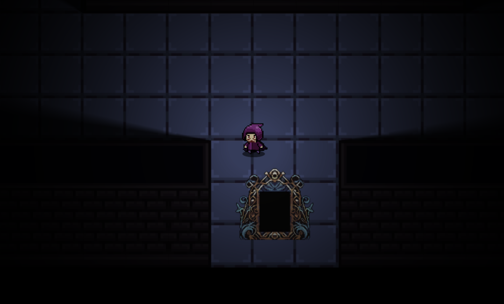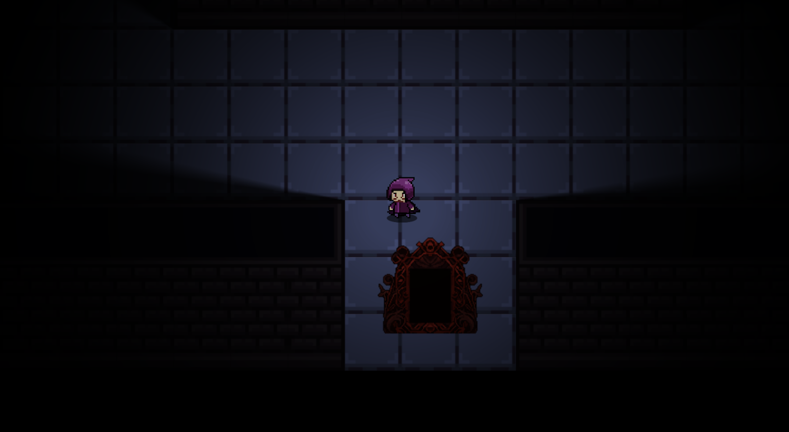  
  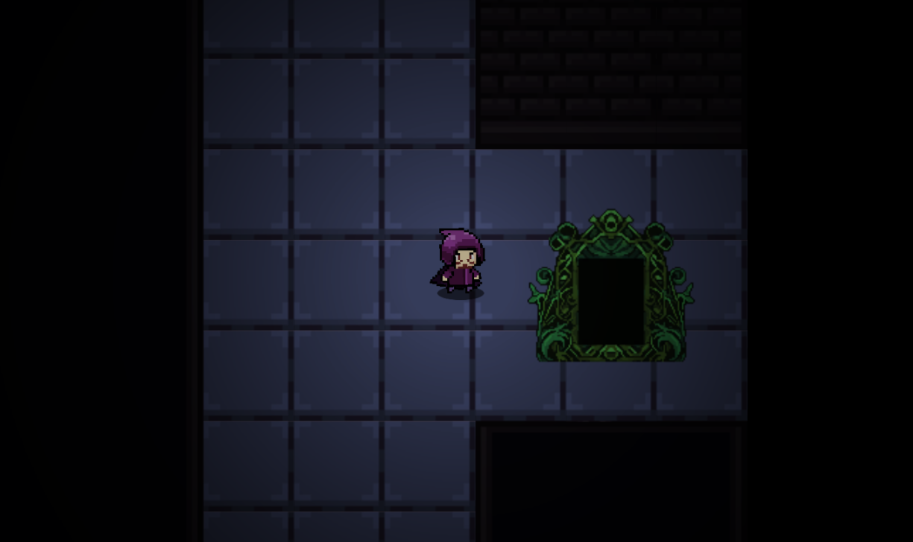  
* Detective: Arrows on the screen shows the positions of the gates  
  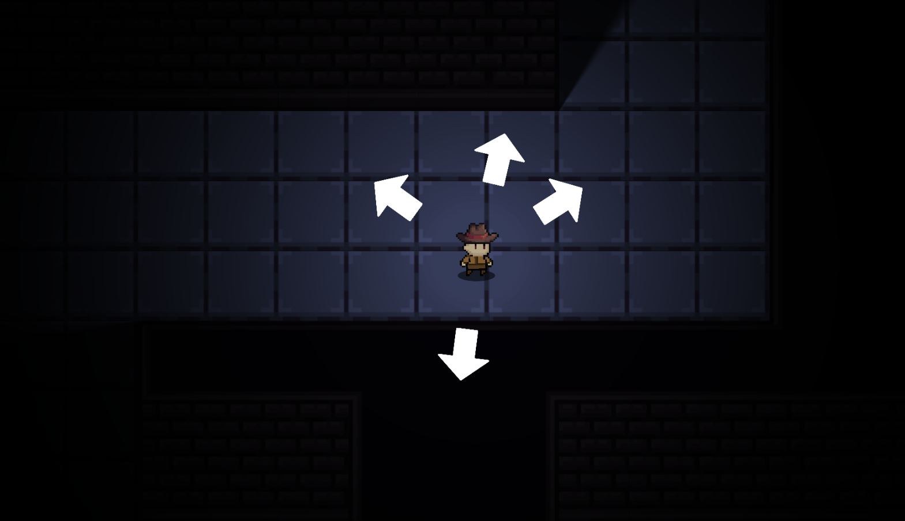  
* Dog: The colored footprint on the ground shows the previous positions of the characters.  
    
  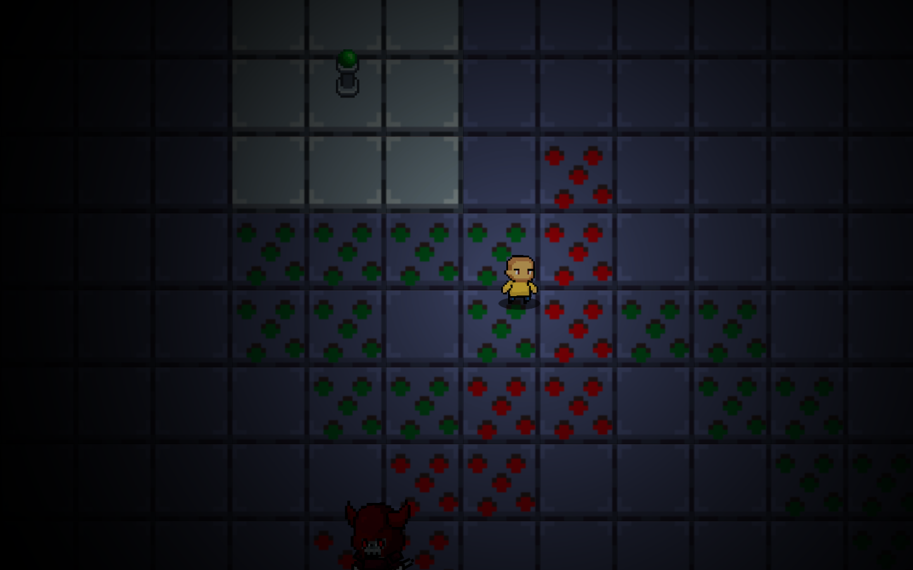  
* Reaper: Can attack the souls

### 5\. UI and start of the game {#5.-ui-and-start-of-the-game}

We've implemented a UI that lets players create lobbies and connect to them using only its number. In the lobby players can choose the role they like.   
    Although there are limitations the lobby has to fit in order to start the game:

* it has only one Reaper player,  
* the amount of players is not less than two,  
* every player has set their status as ready.

When all conditions are fulfilled, the game starts automatically after a short countdown that leaves a room for players to change their mind.  
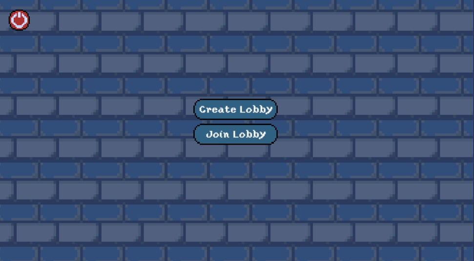  
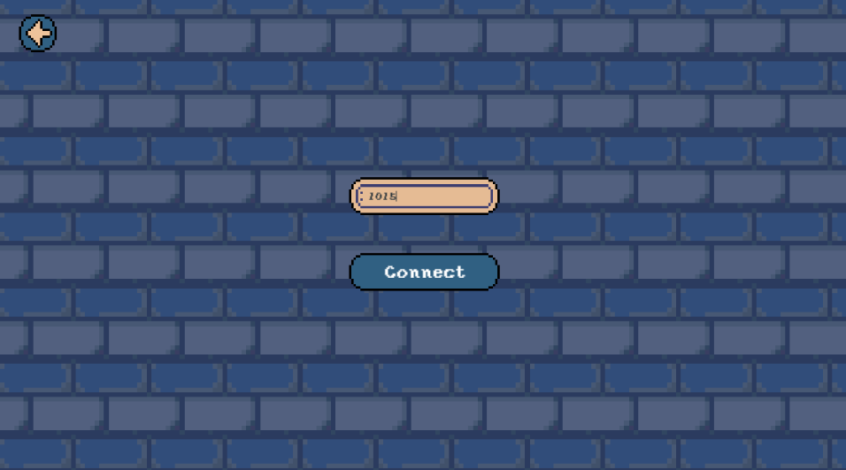  
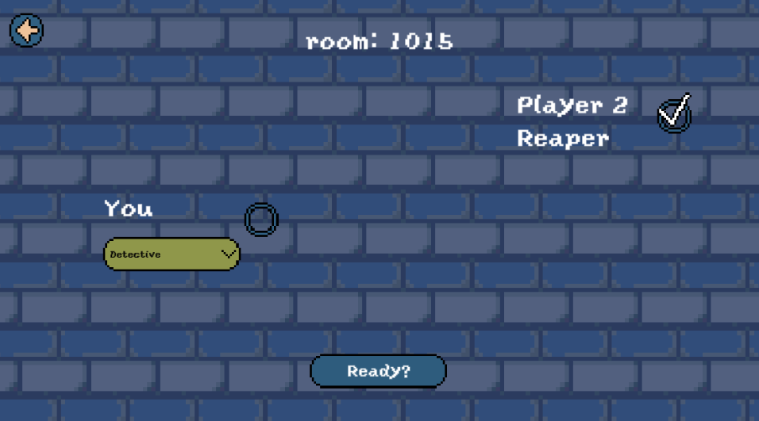

### 6\. End-game logic {#6.-end-game-logic}

* Check soul die from weak  
* Check soul go to hell or heaven  
* Check number of player and conditions:  
  * 2 players, soul escape, soul win, otherwise reaper wins.  
  * 3 players, 2 souls escape, souls win, otherwise reaper wins.  
  * 4 players  
  * 2 souls escape, souls and reaper tie.  
  * 3 souls escape, souls win.  
  * otherwise reaper wins

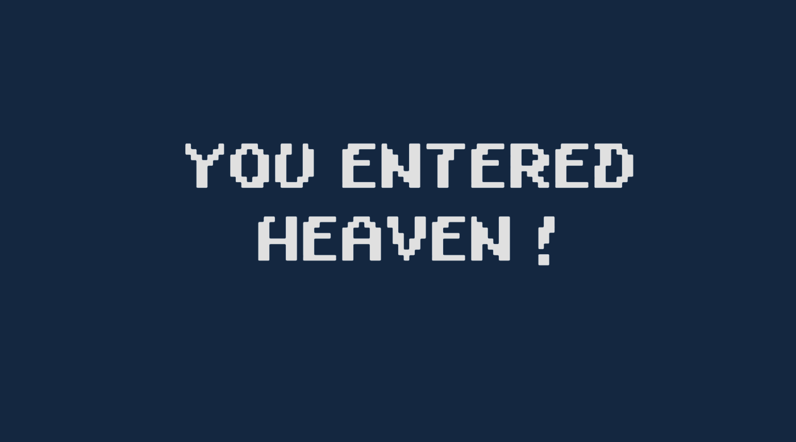

### 7\. Higher goals to reach {#7.-higher-goals-to-reach}

1. More abilities. We have ideas for pickable objects that can give Soul characters one-time abilities. They would make a great addition to the conflict between Souls and Reaper.   
2. Balancing. In the following milestone we'll have to pay extra attention  
3. In-gate Hell mini-game. It was put aside due to other high-priority tasks and will be introduced in the game.  
4. SFX and VFX. 

### 8\. Problems we encountered {#8.-problems-we-encountered}

There was an issue with networking we encountered during our work for this milestone, and it was hard to isolate and identify.

## Milestone 4: Playtesting {#milestone-4:-playtesting}

In this milestone, we had a few groups of people test our game to see whether we achieved our goals in the design and development of the game. We first designed a questionnaire and built our game in Unity to share the build with our participants. We then analyzed and made changes according to the feedback received from each group of participants.

### 1\. Questionnaire design {#1.-questionnaire-design}

We designed a set of questions that we asked from our test groups in a written format or orally. The questions covered multiple aspects of the game, including:  
 the quality of multiplayer, the UI, the controllers, and the general “fun”ness of the game.

* Quality of the game (bugs, glitches, etc.)  
* Quality of multiplayer  
* In-game UI and main menu  
* the controllers  
* the abilities and powers of characters  
* general funness of the game

The questions were mostly open ended and inviting the participants to answer however they like. 

### 2\. General Result of Questionnaire {#2.-general-result-of-questionnaire}

According to the results of the questionnaire, the game did manage to have exciting and fun moments for each character. However, they also faced multiple bugs that need to be fixed before the final release. There were also some balancing issues for different characters, mostly on the reaper side. The participants also recommended some changes or updates to the game that can improve the game in different aspects. Here are some of the feedbacks that we received from one of the testing sessions:

- Reaper: is generally weaker and has no ability to use  
- Reaper: attack is short range and also very precise  
- When a soul enters a gate, the reaper can stay behind it to get it  
- Actions don’t have enough feedback  
- Runner Minigame: it is too forgiving  
- Runner Minigame: player is not seen in some situations  
- Main Menu UI: circles feel like buttons, texts are too small  
- Environment: Gets repetitive after a while  
- Gate Positions: Why are they always on the edges of the map?  
- Multiplayer: Players do not interact that much during the game  
- Minimap: people use Tab to see the minimap all the time, why not put in on the ui  
- Psychologist is weakest, Dogs ability is not really helpful, Detective is the most overpowered.  
- Game seems to be easier for Souls

### 3\. Multi-Round Testing & Iteration {#3.-multi-round-testing-&-iteration}

We conducted three formal testing groups with 5 rounds each, plus additional internal playtests. Between each two groups, we made focused adjustments based on player feedback and in-game observations. Below is a detailed summary of what was changed and why.

#### 3.1 Changes Between Group 1 and Group 2 {#3.1-changes-between-group-1-and-group-2}

##### 3.1.1 Key Feedback {#3.1.1-key-feedback}

* Reaper struggled to hit Souls. Movement felt clunky and attacks often missed.

##### 3.1.2 Rebalancing   {#3.1.2-rebalancing}

* Increased Reaper’s movement speed to better catch up with Souls.  
* Lowered attack cooldown and reduced post-attack slowdown for smoother combos.  
* Enlarged the attack collider size to improve hit accuracy.  
* Added an attack direction pointer to help Reaper aim more effectively.

##### 3.1.3 UX and UI Improvements {#3.1.3-ux-and-ui-improvements}

* Added a red attack indicator in the UI.  
* Background music was added to the lobby and in-game scenes for atmosphere.

#### 3.2 Changes Between Group 2 and Group 3 {#3.2-changes-between-group-2-and-group-3}

##### 3.2.1 Key Feedback {#3.2.1-key-feedback}

* Reaper had trouble locating Souls.  
* Players reported a lack of responsive control feeling.

##### 3.2.2 Visibility & Game Feel Enhancements {#3.2.2-visibility-&-game-feel-enhancements}

* Souls now make footstep sounds, giving audio cues to the Reaper.  
* Stress music is triggered when Soul and Reaper are near each other.

##### 3.2.3 Control & Feedback Improvements {#3.2.3-control-&-feedback-improvements}

* Added ghosting VFX to Soul's dash for visual clarity.  
* Introduced Reaper’s attack sound effects and Soul’s hit feedback SFX.

#### 3.3 Fixes and Upcoming Changes {#3.3-fixes-and-upcoming-changes}

##### 3.3.1 Bug Fix {#3.3.1-bug-fix}

* Removed the need to restart the client after every match.

##### 3.3.2 Rebalancing {#3.3.2-rebalancing}

* Adjusted Reaper’s collider shape/size for more accurate combat.  
* Increased cooldown of Soul’s dash to prevent overuse.  
* Reaper will now be able to identify the type of gate at a glance.

##### 3.3.3 UX Improvements {#3.3.3-ux-improvements}

* Decision pending: either make the minimap persist on-screen or remove it entirely.  
* Small tweaks in the Hell minigame and Altar minigame to improve pacing.  
* Increased font size in the UI for better readability.  
* Added visible nicknames for all players to aid identification.

##### 3.3.4 New Features and Add-ons {#3.3.4-new-features-and-add-ons}

* Communication    
  * Added a chat system exclusive to Souls, allowing secret coordination without revealing info to the Reaper.  
* Game Cues & Info    
  * Reaper now receives more passive information: distinguish if the gate is hell or not.  
  * Visual and audio cues from gates when someone successfully clears the Runner minigame.  
* Tutorial    
  * Added an image of the Hell gate to the tutorial.    
  * Tip: A simple text-based tutorial has already been implemented in the main menu.  
* Visual & Gameplay Enhancements    
  * considering adding unique VFX or a special ability to Reaper to increase presence and strategic depth.    
  * Rebalancing sections of the Runner minigame that were too difficult compared to others.

## Milestone 5: Final Release {#milestone-5:-final-release}

### 1\. Game Introduction {#1.-game-introduction}

**Heaven of Hell** is a top-down 2D asymmetric PvP multiplayer game, where a team of players (Souls) tries to escape from a deadly maze, while a single Reaper hunts them down. The game is set in a procedurally-generated, maze-like map that combines deduction, teamwork, and intense chases. Souls aim to find the heaven gates and escape, but must avoid hell gates and the relentless Reaper, who uses unique abilities to track and capture them.

The core innovation of Heaven of Hell lies in its blend of:

* **Asymmetric roles** (one vs many, with unique abilities and vision)

* **Randomly-generated maps** for replayability

* **Integrated mini-games** to resolve key situations (escape, revive)

* **Real-time multiplayer with custom networking**

### 2\. Gameplay {#2.-gameplay}

Players join a pre-game lobby, where they select their roles: **Reaper** or one of several unique **Soul** classes (Dog, Psychologist, Detective). Only one player can be the Reaper; others must choose different Soul types.

#### **Game Flow:** {#game-flow:}

* **Objective for Souls:** Escape through heaven gates before being caught or banished by the Reaper.

* **Objective for Reaper:** Prevent Souls from escaping by hunting them down.

#### **Key Features:** {#key-features:}

* **Randomly Generated Maze:** The map, including the placement of gates (heaven/hell) and the central altar, is procedurally generated every game, making each round unique.

* **Asymmetric Abilities:**

  * **Reaper:** Faster movement, less limited vision, can attack and temporarily debilitate Souls, special senses to locate Souls in minigame.

  * **Dog:** Sees fading trails of other Souls.

  * **Psychologist:** Can check a gate’s destination before entering once per game.

  * **Detective:** Sees directional hints to all gates.

* **Mini-Games:**

  * **Altar Mini-Game:** Reviving weakened Souls by cooperating and completing a button-sequence mini-game.

  * **Hell-Gate Runner:** Escaping from hell via a runner-style mini-game, dodging obstacles and racing against a wall of fire.

* **Teamwork and Communication:** Psychologist can mark gates (red/green) and use an in-game chat for coordination (hidden from Reaper).

* **Dynamic Win Conditions:** The number of Souls that escape determines whether the Souls, Reaper, or neither win.

### 3\. Technical Implementation {#3.-technical-implementation}

#### 3.1 Server {#3.1-server}

**Custom Server Architecture:**

* **UDP with KCP protocol** for real-time, low-latency communication.

* **Epoll-based** event loop for handling many connections efficiently.

* **Multi-threaded**: Separate threads for networking and game logic, safe communication via lock-free queues.

* **State synchronizatio**n: 60Hz core logic tick, 20Hz state broadcast.

* **Room system**: Each match is an independent room with all logic managed server-side (not fully authoritative for rapid iteration).

* **Reconnection Support:** Players can reconnect to matches seamlessly after disconnects.

**Protocol Buffers:** Used for all client-server message serialization, ensuring efficient and cross-platform data exchange.

**Procedural Map Generation:**

* Maps are generated server-side and transmitted to clients via Run-Length Encoding (RLE) for compression.

* Gates, altar, abilities, and obstacles are all randomly placed according to strict game design rules, ensuring fairness and replayability.

#### 3.2 Client {#3.2-client}

The Unity client implements all gameplay, rendering, and player interaction. Key highlights:

##### 3.2.1 character container system {#3.2.1-character-container-system}

**Component-Based Architecture:** Each player character (Soul or Reaper) is a container with modular components for movement, abilities, health management, animation, and sound.

**Ability Logic:**

* Each class's abilities are encapsulated, allowing easy extension or balancing.

* One-time abilities and interaction logic (e.g., traps, fake Souls) are unified in a prop/ability system.

**State Sync:** Receives state updates from server, triggers local interpolation and animation changes.

##### 3.2.2 Audio {#3.2.2-audio}

**Immersive Audio Design:**

* Spatial footstep sounds to help Reaper track Souls.

* Stress music cues when Reaper and Souls are close, intensifying the chase.

* Unique SFX for attacks, abilities, altar/gate interactions, and ambient atmosphere.

* Lobby and in-game background music enhance immersion.

##### 3.2.3 Minigame {#3.2.3-minigame}

**Altar Mini-Game:**

* Fast-paced sequence matching; success revives the weakened Soul  
* Designed for tension and teamwork.

**Hell-Gate Runner:**

* Auto runner game with procedurally placed obstacles and speed boosts.

* The soul must reach the end before health runs out; collisions slow progress and increase risk.

* Visual clarity (camera positioning, VFX) improved iteratively after testing.

### 4\. Project Management {#4.-project-management}

At the beginning of the project, we designed a detailed task list and timeline, which all team members followed closely. As the project progressed into later stages, we introduced a Kanban board to organize and track ongoing issues and tasks more effectively. Communication was maintained through a dedicated Discord channel, supplemented by weekly in-person and online meetings to ensure everyone was aligned and any challenges were addressed promptly.  
Links to the Project Management: [LayeredDevelopmentDescription](https://docs.google.com/spreadsheets/d/1SO5hNJbKYdYcmCY6clr3qx5wAMFBpgJrpL9Bp9rKb8w/edit?usp=sharing)

#### 4.1 Task List {#4.1-task-list}

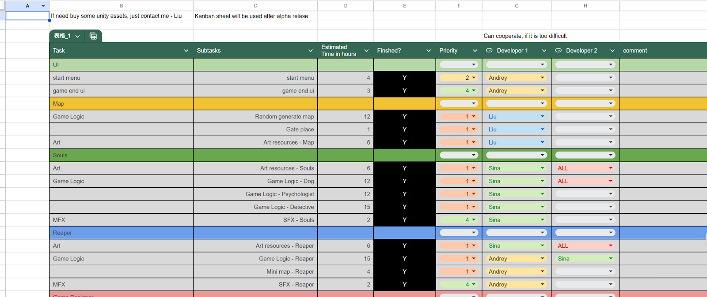

#### 4.2 Timeline {#4.2-timeline}

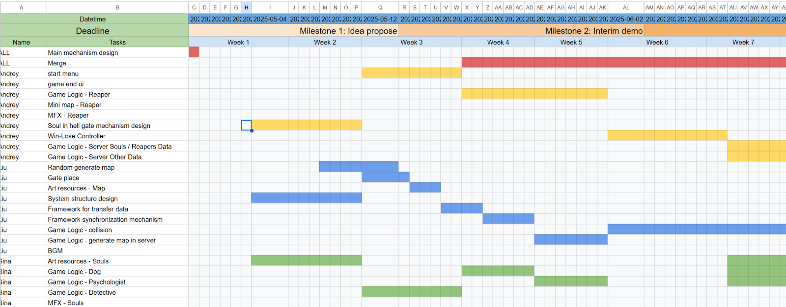

#### 4.3 Kanban {#4.3-kanban}

.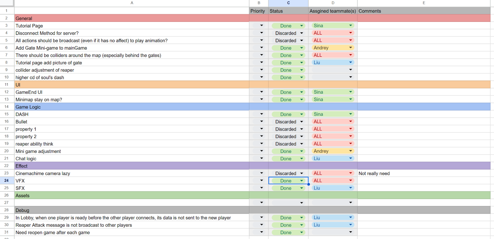

### 5\. Testing & Optimization {#5.-testing-&-optimization}

#### 5.1 Balance {#5.1-balance}

**Multiple Rounds of Playtesting:**

* Three formal playtest groups, each with at least five rounds, plus additional internal tests.

* Focused on Reaper/Soul win rates, class usefulness, escape difficulty, and ability impact.

**Balance Adjustments:**

* Tweaked Reaper speed, attack cooldowns, and hitboxes for fairer chases.

* Adjusted Soul dash ability cooldown.

* Balanced Psychologist/Detective/Dog to ensure no class is overpowered or useless.

* Changed minimap and gate positions based on feedback for improved flow.

**Dynamic Win Conditions:**

* Adjusted to prevent stalemates and encourage both teamwork and individual play.

#### 5.2 Gameplay Feel {#5.2-gameplay-feel}

**Polish and Feedback:**

* Added visual (VFX) and audio (SFX) feedback for all key actions (attacks, hits, escapes).

* Ghosting effect for Soul dash, attack direction pointer for Reaper, visible nicknames, and better UI scaling.

* Improved map aesthetics and variation to reduce repetitiveness.

**Accessibility:**

* Enlarged UI elements for readability.

* Simple, clear tutorial added to the main menu and game start.

**Performance Optimizations:**

* Efficient tilemap rendering and asset streaming to support lower-end hardware.

* Network optimizations (message batching, compression).

### 6\. Summary & Reflection {#6.-summary-&-reflection}

**Heaven of Hell** evolved from a core idea of asymmetric multiplayer tension into a full-featured, replayable PvP game with unique mechanics and technical depth. Through multiple development milestones and playtesting rounds, we iteratively improved gameplay balance, technical robustness, and player experience.

Key takeaways include:

* The challenge and reward of building a custom networking stack and procedural map system from scratch.

* The importance of user feedback and frequent playtests for balancing and polish.

* The need for continuous communication and coordination in both gameplay and team workflow.

The final release delivers a tense, atmospheric, and replayable multiplayer experience that blends the unpredictability of procedural maps with the drama of asymmetric roles and real-time strategy.

#### 6.1 Questions need be answer as requirement of course {#6.1-questions-need-be-answer-as-requirement-of-course}

1. **What was the biggest technical difficulty during the project?**  
   The biggest technical difficulty was building a robust, real-time custom multiplayer networking system from scratch, especially synchronizing procedural map generation and player states reliably across all clients. Debugging networking bugs and ensuring smooth reconnections also proved challenging.  
2. **What was your impression of working with the theme?**  
   The “Heaven and Hell” theme was inspiring and gave our project a strong sense of atmosphere and direction. It helped us shape both the gameplay mechanics and the visual style, making the experience cohesive and memorable.  
3. **Do you think the theme enhanced your game, or would you have been happier with total freedom?**  
   The theme definitely enhanced our game. Rather than feeling restricted, it sparked creativity in both the game mechanics (like the altar, heaven/hell gates, and soul abilities) and visual design. Having a strong theme gave our team a shared vision.  
4. **What would you do differently in your next game project?**  
   In the next project, we would aim for earlier and more frequent playtesting, and strive to make our server more fully authoritative from the start. We would also adopt even more agile planning and leave more buffer time for polish and unexpected issues.  
5. **What was your greatest success during the project?**  
   Our greatest success was integrating all the custom systems—multiplayer networking, procedural map generation, character abilities, and mini-games—into a polished and genuinely fun gameplay loop, supported by strong teamwork and communication.  
6. **Are you happy with the final result of your project?**  
   Yes, we are proud of what we accomplished. The game is fun, atmospheric, and technically ambitious. Seeing it come together and watching people enjoy playing it was very rewarding.  
7. **Do you consider the project a success?**  
   Absolutely. Despite some challenges and compromises, we delivered a working, original multiplayer game that hit most of our goals and provided a meaningful learning experience.  
8. **To what extent did you meet your project plan and milestones (not at all, partly, mostly, always)?**  
   We met our project plan and milestones and absolutely followed the timeline designed at the beginning of semester, partially thanks to the experience of participating in the Game Lab course last semester. While some features were adjusted or re-scoped based on playtesting and feedback, the core roadmap was followed and all main deliverables were completed.  
9. **What improvements would you suggest for the course organization?**  
   It would be helpful to have more opportunities for peer feedback and playtesting between teams throughout the development process. Regular checkpoints and clear guidance on project documentation expectations would also help teams stay on track.  
