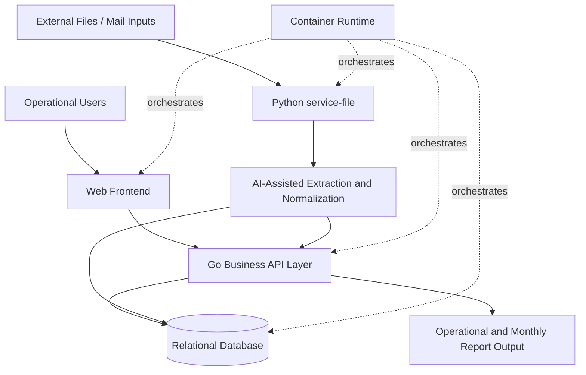
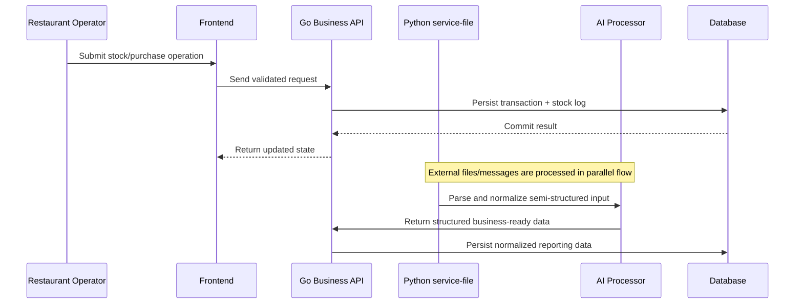
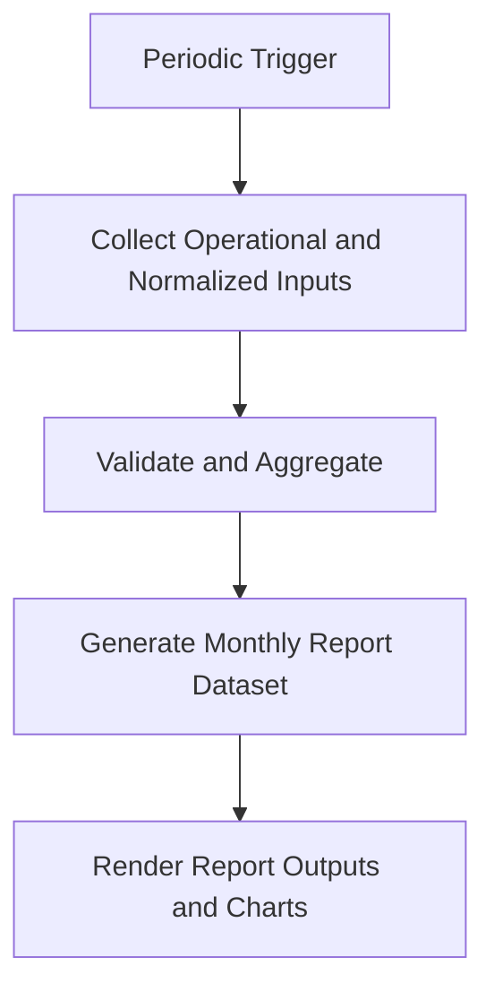

## Comprehensive Project Summary

## 1. Executive Overview

The **Munich Restaurant & Beverage Platform** is a full-stack, multi-service system for end-to-end beverage operations in restaurant environments.
The scope includes the full beverage domain (not only alcohol), such as soft drinks, water, juices, coffee-related products, and other drink categories.

Each month
- each branch restaurant in the hospitality group assigns staff to conduct inventory counting; 
- an AI pipeline extracts procurement details from purchase invoices; integrates sold-beverage data from the sales system (including by-the-glass sales and the same beverage purchased in different container sizes); 
- and produces a consolidated monthly report.

This project combines:

- A web frontend for operational workflows
- A Go-based API layer for core business transactions and domain logic
- A Python-based `service-file` module for ingestion, file processing, and AI-assisted normalization
- A relational database for operational records and reporting
- A containerized runtime model for consistent deployment

A key differentiator is the **AI-enhanced `service-file` pipeline**, which improves extraction quality from semi-structured input, reduces manual reconciliation, and increases reporting consistency.

---

## 2. Problem Space and Product Intent

Restaurant beverage operations are often fragmented across spreadsheets, messaging channels, and disconnected systems.
This platform addresses those gaps by centralizing:

- Beverage catalog and classification
- Supplier and purchasing relationships
- Restaurant-level inventory and stock-check workflows
- Report generation and periodic operational updates
- Structured auditability of stock and transactional events

### Core Product Intent

1. Provide a single source of truth for beverage-related operations.
2. Improve operational consistency across restaurants and operational workflows.
3. Reduce manual reconciliation and repetitive administrative work.
4. Make reporting and monthly summaries easier and more reliable.
5. Support future expansion into broader F&B operational intelligence.

---

## 3. Scope Delivered

The delivered scope includes cross-layer capabilities across frontend, backend, database, and operational scripts.

### 3.1 Frontend Scope

- Interactive web user interface for operational users
- Module-based UI structure for maintainability
- API-driven data display and update workflows
- Role-aware screens and user actions
- Standardized form handling and validation feedback

### 3.2 Backend Scope

- API endpoints for domain entities and operations
- Business logic for beverage lifecycle and stock workflows
- Authentication and authorization middleware patterns
- Batch and periodic task support
- Utility modules for cross-cutting concerns

### 3.3 `service-file` and AI Processing Scope

- Ingestion of operational files/messages from external channels
- Parsing and validation of semi-structured inputs
- AI-assisted extraction and normalization for report-ready fields (Based on GPT)
- Structured handoff of processed data into business/reporting flows

### 3.4 Data and Reporting Scope

- Relational schema to support operational entities
- Migration-based schema evolution
- Monthly and periodic report-oriented logic
- Structured stock-check logs and traceability

### 3.5 Operational and Deployment Scope

- Container-first service orchestration
- Development and push/deployment compose variants
- Seed/test data insertion scripts
- Environment-based runtime configuration

---

## 4. Domain Model (Business Perspective)

The platform centers around the beverage operations lifecycle:

- **Restaurants**: operating units where stock and transactions occur
- **Beverages**: products consumed, sold, purchased, or stocked
- **Suppliers**: vendors providing beverage products
- **Purchases**: procurement records linked to suppliers and products
- **Stock Checks**: physical verification events for inventory confidence
- **Stock Check Logs**: detailed trace records for reconciliation
- **Users**: operators, checkers, and administrators with role-based access
- **Reports**: monthly or periodic summaries for management and auditing

This domain modeling supports both transactional workflows (daily operation) and analytical workflows (monthly reporting).

---

## 5. System Architecture

The platform follows a layered architecture with clear separation of concerns.

## 5.1 High-Level Architecture (Mermaid)

## 5.2 Architectural Characteristics

- **Layered**: UI, API/services, data persistence, runtime orchestration
- **Modular**: domain-specific controllers and middleware separation
- **Polyglot backend**: right-language-for-task approach (Go + Python)
- **AI-assisted ingestion**: structured extraction pipeline via `service-file`
- **Containerized**: reproducible local and deployment behavior
- **Migration-driven schema**: controlled database evolution

---

## 6. Technology Stack

### Frontend Layer

- **Vue.js** ecosystem for component-driven UI
- **TypeScript/JavaScript** for interaction and maintainability
- **Package-managed build workflow** for repeatable frontend builds

### Core Business Service Layer

- **Go services** for domain APIs, transaction workflows, and role-aware operations
- **Middleware architecture** for authentication and authorization

### Intelligent Processing Layer (`service-file`)

- **Python service-file module** for ingestion, parsing, transformation, and integration
- **AI-assisted processing** to extract/normalize report-relevant information
- Validation and transformation pipeline bridging external inputs and internal records

### Data Layer

- **Relational database** with SQL-first modeling
- **Migration scripts** for schema lifecycle management
- **Seed/test data support** for development and verification

### Runtime and Tooling

- **Docker Compose-based orchestration** for service coordination
- **Environment-driven configuration**
- **Shell and batch utility scripts** for local ops tasks

---

## 7. Backend Design Details

## 7.1 API and Controller Organization

The backend is organized around domain-focused controllers, including areas such as:

- Beverage entities and categorization
- Supplier and purchase workflows
- Restaurant and restaurant-specific beverage relations
- Stock checks and stock-check logs
- User and role management
- Authentication endpoints
- Monthly report-related endpoints
- Batch task and database update orchestration

This structure improves reasoning by business capability rather than by technical utility alone.

## 7.2 Middleware and Access Control

The backend includes middleware layers for:

- Identity verification (authentication)
- Role-specific access constraints (e.g., admin/checker capabilities)
- Guardrails around sensitive operational endpoints

This supports operational safety and prevents unauthorized data manipulation.

## 7.3 Data Integrity and Operational Consistency

- Structured writes for transactional records
- Audit-friendly stock-check logging
- Controlled migration ordering for schema consistency
- Separation of operational data from processing state where needed

---

## 8. Data and Reporting Workflows

## 8.1 Core Data Flow with AI-Assisted Ingestion (Mermaid)

## 8.2 Monthly Reporting Flow (Mermaid)

The reporting logic transforms transactional and normalized ingestion data into client-facing monthly outputs.

---

## 9. Integration and AI-Enhanced File Processing

The `service-file` service is a dedicated Python module that turns external inputs into structured business-ready data.

Core capabilities include:

- Intake of files/messages used in daily operations
- Parsing and validation of semi-structured inputs
- Gmail authentication and authorization for email-based purchase invoice ingestion (OAuth2)
- AI-assisted extraction and normalization of invoice fields
- Mapping normalized output into operational and reporting structures
- Reducing manual reconciliation effort for monthly reporting

This layer directly improves report quality by increasing consistency and completeness before final aggregation.

---

## 10. DevOps and Environment Strategy

## 10.1 Containerized Environments

The project uses multiple compose-oriented runtime modes (development and deployment variants), enabling:

- Consistent local setup
- Reproducible service dependencies
- Easier handoff between environments

## 10.2 Configuration and Secrets Approach

- Environment variables control runtime behavior
- Service-level config separation supports modular deployment
- Runtime scripts simplify common operational commands

## 10.3 Data Bootstrap and Reset Support

- SQL/script-based initialization paths
- Test data insertion for reproducible QA scenarios
- Local operational recovery and verification workflows

---

## 11. Quality, Reliability, and Maintainability

## 11.1 Maintainability Enablers

- Domain-based module separation
- Migration-based schema evolution
- Middleware decomposition for security concerns
- Distinct service responsibilities by workload type

## 11.2 Reliability Practices

- Structured logging and operational traces around stock checks
- Deterministic startup through container orchestration
- Explicit dependency management per language ecosystem
- Controlled DB state transitions through migrations

## 11.3 Testability Considerations

- Scriptable test-data setup
- Service-level modularity conducive to targeted testing
- Integration-friendly architecture for end-to-end verification

---

## 12. Security and Access Control Posture

The platform includes foundational operational security controls:

- Authenticated API access
- Role-aware authorization boundaries
- Service-level logic gates on privileged actions
- Separation of user roles from operational transactions

Recommended future hardening can include:

- Rate limiting and API abuse protection
- Expanded audit trails for administrative actions
- Secret rotation and centralized secret management
- Security scanning in CI for dependencies and containers

---

## 13. Non-Functional Outcomes

The implemented architecture supports key non-functional goals:

- **Scalability**: modular services and clear domain boundaries
- **Resilience**: isolated service responsibilities and containerized runtime
- **Extensibility**: straightforward addition of new beverage workflows
- **Operational Efficiency**: reduced manual reconciliation and faster reporting
- **Maintainability**: clear module boundaries and predictable service responsibilities support long-term evolution

---

## 14. Challenges Addressed

The project addresses typical operational and engineering challenges:

1. **Cross-layer integration** across UI, backend, and data concerns
2. **Data consistency** in stock and purchase records
3. **Workflow standardization** across users and restaurants
4. **Periodic reporting reliability** from transactional and ingested data
5. **Environment reproducibility** in local and deployment contexts

---

## 15. Future Direction (Client-Driven)

The next phase should be directly guided by client reporting requirements:

- Increase the breadth and depth of data shown in final reports
- Improve and expand chart/visual presentation requested by the client
- Adjust report structure and KPI emphasis according to client feedback cycles

In short, future work should prioritize what the client needs to see in the final report, both in data detail and visualization quality.

---

## 16. Naming and Positioning

To accurately represent the business scope (all drinks, not only alcohol), the recommended English product name is:

**Munich Restaurant & Beverage Platform**

Why this name works:

- **Munich**: location/brand identity
- **Restaurant**: target operating context
- **Beverage**: inclusive domain (alcoholic + non-alcoholic)
- **Platform**: signals extensible, multi-module system

---

## 17. Final Assessment

The project has established a strong operational foundation for restaurant beverage management through:

- Clear domain modeling
- Multi-service backend architecture
- AI-enhanced `service-file` ingestion and normalization
- Practical UI-to-data workflow integration
- Containerized deployment strategy
- Reporting-oriented data pipeline capabilities

It is implementation-focused, operationally practical, and ready for client-driven enhancement of final report data and visual outputs.
