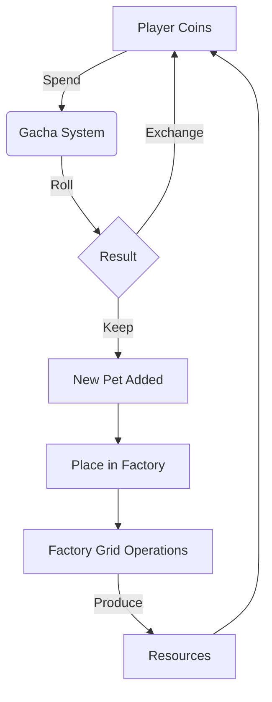
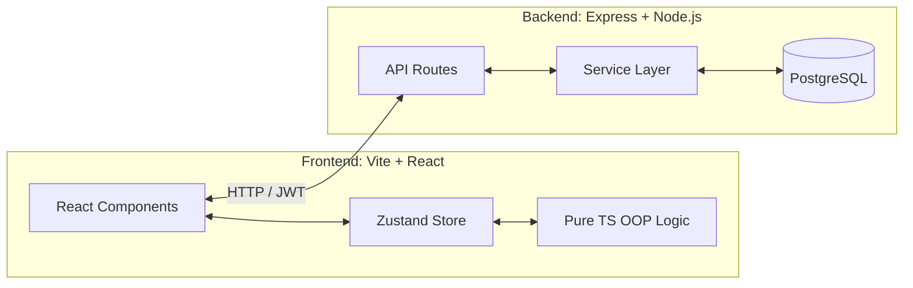

**PixPet** is a full-stack pixel-art pet-raising and factory-building game. It combines casual pet collection with intricate grid-based factory logistics management.

## 🎮 Gameplay Mechanics

The game revolves around two distinct yet interconnected loops: the **Pet Gacha System** and **Automated Factory Building**.

- **Pet Gacha System (Collection & Economy):** 
  - Players obtain pets through daily-limited gacha rolls. Rolls are mathematically weighted across 7 rarity tiers (from Common up to Mythical).
  - The system embraces flexibility for duplicate pulls: when obtaining a pet they already own, players make a tactical choice to either keep the duplicate or instantly exchange it for coins (exchange value scaling based on rarity).
  - Pets feature personal stats like `hunger`, `mood`, and specific size scales that individualize each pulled creature.
  - Also includes Inventory System, Pokédex System.

  

- **Automated Factory Operations (Core Puzzle Mechanics):** 
  - **Elemental Production Lines:** The factory operates on pet types acting as processing machines:
    - *Raw Materials:* **Grass** pets produce bio raw materials; **Rock** pets produce ores.
    - *Processing:* **Fire** pets cook bio materials and smelt ores into liquid steel.
    - *Precision & Output:* **Water** and **Normal** pets work in tandem to transform liquid steel into parts, and output final products (`pet_food` or `metal_product`).
    - *Special Nodes:* **Psychic** pets create goods out of thin air, **Ghost** pets act as random multi-pliers, and other special types act as adaptable wildcards (Ditto-style).
  - **Buff System:** Auxiliary pets provide passive boosts rather than producing goods (e.g., **Bug** speeds up Grass, **Flying** boosts Fire/Water).
  - **Pipeline Thermodynamics:** Pipes connecting nodes generate heat when transporting items. To prevent pipes from exceeding 100 Heat and melting down, players must hook up **Ice** type pets which supply intrinsic cooling rates to the pipeline.
  - **Global Simulation Factors:**
    - **Speed (Electricity):** **Electric** pets supply energy. Higher electricity reduces the global **tick** interval, speeding up the entire factory from a base of 5 seconds per tick down to 1 second.
    - **Pollution:** Production natively creates pollution. If global pollution hits 100%, the factory shuts down. **Poison** pets act as cleansers and are required to keep pollution low.
    - **Space (Grid Size):** The factory starts with a limited grid. Placing **Dragon** pets permanently expands the board, allowing for grander operations.
  - **Output Logistics:** Products must be successfully routed to edge map portals to matter: `pet_food` converts to pet experience/satiety, while `metal_product` converts 1:1 into player Coins.

  

- **Social & Base Building:** 
  - Accumulated wealth from both gacha exchanges and factory production improves the player's overarching "Home" environment.
  - Several player can share the "home".
  - Features real-time "Read-Only" visitation. Players can seamlessly query a friend's factory layout to study their pipeline connections and cooling strategies securely, as editing interactions are disabled in spectator mode.

## 💻 Technical Architecture

The project adopts a modern full-stack **TypeScript** architecture, separating UI reactivity from pure business logic.

### Frontend Details
- **Framework & Build:** React 18 and React DOM, powered by **Vite** for fast client-side bundling.
- **State Management:** Uses **Zustand** extensively (e.g., `useFactoryStore`) to bridge UI Reactivity with an underlying structural OOP approach. 
- **Object-Oriented Factory Logic:** The complex factory grid uses pure TypeScript classes (like Factory, PipeChain) underlying the UI. The factory client heavily uses algorithms to calculate dynamically shaped pipe junctions (e.g., `CROSS`, `T_LUR`) and computes heat routing frame-by-frame tick().
- **Persistence:** Local storage is used as a fallback and an optimistic cache when saving factory layouts, while also regularly committing snapshots back to the server.

### Backend Details
- **Environment & Routing:** Runs on Node.js using **Express.js**. In development, it leans on `tsx` for real-time TypeScript execution.
- **Database Architecture:** Uses **PostgreSQL** (`pg`). Schema structures are rigorously maintained using `node-pg-migrate` to ensure a consistent relational setup for users, homes, pets, and abstract factory layout JSONs.
- **Service-Oriented Design:** The code implements a strict Service layer (e.g., factoryService.ts, gachaService.ts) separate from routes.
  - *Data Integrity:* Financial/Gacha mechanics aggressively utilize SQL transactions (`BEGIN`, `COMMIT`, `ROLLBACK`) preventing duplicate item bugs or race conditions.
- **Validation & Security:** All incoming request payloads are type-checked linearly via **Zod**. Security relies on `bcryptjs` for encryption and `jsonwebtoken` for stateless, scalable API authentication.
