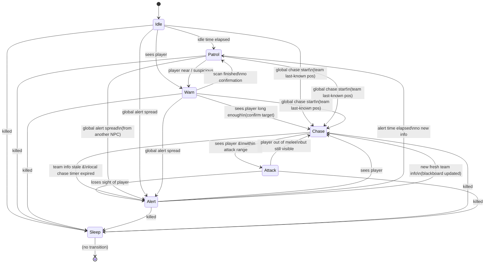
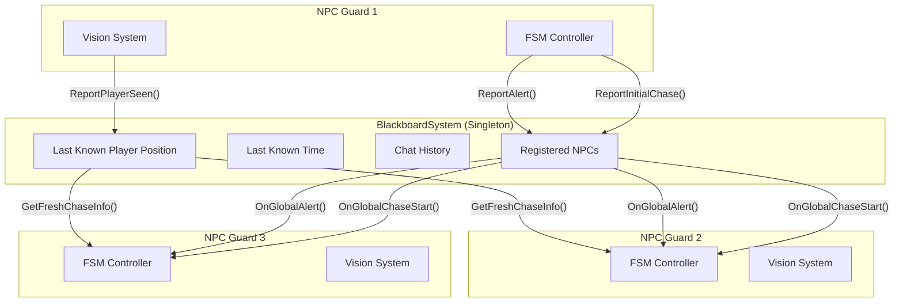
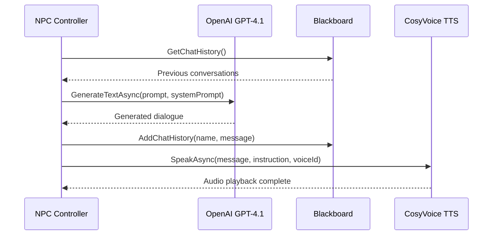
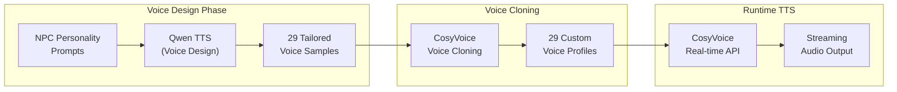
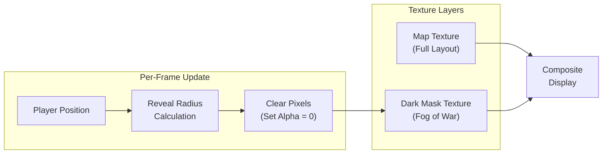

* Yifei Liu
* Andrey Roytman
* Alexandru Mircea Ulesa
* Sina Bolouki

*This project uses fictional reconstruction to examine the historical phenomenon of behavioral correction institutions, aiming to encourage critical reflection through interactive storytelling.*

---

A 2D stealth game where a student attempts to escape from an internet addiction rehabilitation school. The game serves as a technical demonstration of modern AI techniques applied to game development, including Finite State Machines (FSM), Blackboard Systems, Procedural Content Generation (PCG), Large Language Model (LLM) integration, and real-time Text-to-Speech (TTS).


---

## Table of Contents

- [Game Overview](#game-overview)
- [AI Systems Architecture](#ai-systems-architecture)
  - [Finite State Machine (FSM)](#finite-state-machine-fsm)
  - [Blackboard System](#blackboard-system)
  - [Procedural Content Generation (PCG)](#procedural-content-generation-pcg)
  - [LLM Chatting System](#llm-chatting-system)
  - [Text-to-Speech (TTS) System](#text-to-speech-tts-system)
  - [Minimap with Fog of War](#minimap-with-fog-of-war)
- [Technical Implementation Details](#technical-implementation-details)
- [Getting Started](#getting-started)

---

## Game Overview

**Escape From Pavlov** is a top-down 2D stealth game built in Unity. Players control a student trapped in a behavioral correction facility who must navigate through procedurally generated environments while avoiding detection by AI-controlled guards and surveillance cameras.

### Core Gameplay Features

- **Stealth Mechanics**: Hide from guard line-of-sight, use obstacles for cover, or use maximum 3 tranquilizer syringes to disable guards temporarily for improving fault tolerance.
- **Procedurally Generated Maps**: Each playthrough features a unique facility layout
- **Intelligent NPCs**: Guards exhibit realistic patrol and investigation behaviors
- **Dynamic AI Conversations**: Guards converse with each other using LLM-generated dialogue
- **Real-time Voice Acting**: All NPC dialogue is voiced using AI text-to-speech


---

## AI Systems Architecture

### Finite State Machine (FSM)

The NPC behavior system is built upon a robust Finite State Machine architecture. Each guard operates independently with seven distinct states:

| State      | Description                                                             |
| ---------- | ----------------------------------------------------------------------- |
| **Idle**   | Standing still, relaxed. Transitions to Patrol after a short duration.  |
| **Patrol** | Moving between assigned waypoints along predefined routes.              |
| **Warn**   | Investigating a suspicious location, approaching and scanning the area. |
| **Alert**  | High alert mode, actively searching the last known player area.         |
| **Chase**  | Actively pursuing the player at maximum speed.                          |
| **Attack** | Engaging the player at close range (game over trigger).                 |
| **Sleep**  | Permanently disabled (eliminated from gameplay).                        |

#### State Transition Diagram



#### Vision System

Guards use a cone-based vision system with:
- **View Radius**: Configurable detection range (default: 10 units)
- **View Angle**: Field of view cone (default: 90°)
- **Obstacle Occlusion**: Raycasting against obstacle layers
- **Player Hiding Detection**: Guards cannot detect hiding players

```csharp
private bool CanSeePlayer()
{
    if (PlayerContainer.Instance && PlayerContainer.Instance.IsHiding()) return false;
    // Distance check, angle check, and raycast for obstacles
    ...
}
```


---

### Blackboard System

The **Blackboard System** enables team-wide coordination among NPCs, creating emergent group behaviors that feel more realistic and challenging.

#### Architecture Overview



#### Key Features

| Feature                       | Description                                                                                                           |
| ----------------------------- | --------------------------------------------------------------------------------------------------------------------- |
| **Team Alert Propagation**    | When one NPC becomes alerted, the information spreads to nearby NPCs after a configurable delay (default: 5 seconds). |
| **Chase Information Sharing** | NPCs share the player's last known position with throttled updates (cooldown: 5 seconds).                             |
| **Information Freshness**     | Shared intel has a validity window (default: 10 seconds). Stale information triggers deescalation.                    |
| **Chat History Tracking**     | Records all NPC conversations for LLM context continuity.                                                             |

#### Decision Priority

Each NPC evaluates information sources in this priority order:

1. **Local Vision** (Highest) - Direct sight of the player
2. **Blackboard Info** (Medium) - Fresh team-shared intelligence  
3. **No Info** (Lowest) - Chase timer counts down, eventually leading to deescalation

---

### Procedural Content Generation (PCG)

The game features a sophisticated BSP (Binary Space Partitioning) based map generation system that creates unique, playable levels for each session.

#### Generation Pipeline


#### Map Configuration

| Parameter        | Value         | Description                                 |
| ---------------- | ------------- | ------------------------------------------- |
| Map Size         | 80 × 34 tiles | Fixed dimensions for consistent gameplay    |
| BSP Max Depth    | 7             | Maximum tree recursion for room subdivision |
| Room Size        | 5-14 × 4-9    | Min/max room dimensions                     |
| Extra Corridors  | 7             | Additional connections beyond BSP tree      |
| Obstacle Density | 10%           | Percentage of room tiles with obstacles     |

#### Room and Corridor Generation

The generator uses BSP to subdivide the map into regions, then places rooms within each leaf node:

```csharp
// BSP split decision based on aspect ratio
if (ratioWH > 1.25) vertical = true;
else if (ratioHW > 1.25) vertical = false;
else vertical = NextDouble01() < 0.5;
```

Corridors are "twin corridors" with a divider wall, creating two parallel pathways (Channel A and Channel B) that NPCs can patrol independently.

#### Entity Placement

| Entity           | Count/Logic                                                               |
| ---------------- | ------------------------------------------------------------------------- |
| **Patrol NPCs**  | 7 per channel (A and B)                                                   |
| **Guard NPCs**   | 2 additional stationary guards                                            |
| **Cameras**      | 6 surveillance cameras with varying FOV (60°-90°) and range (10-16 tiles) |
| **Hiding Spots** | 1 per room cluster, max 6 tiles from cluster center                       |
| **Player Spawn** | Farthest room from target                                                 |
| **Target/Exit**  | Farthest room from player spawn                                           |

#### Threat Map Computation

The system pre-computes a threat heatmap considering:

- **NPC Vision Cones**: Based on patrol routes and facing directions
- **Camera Coverage**: Field of view with optional sweep patterns
- **Distance Falloff**: `1 / (1 + 0.09 * distance)`
- **Angular Falloff**: Reduced threat at cone edges


---

### LLM Chatting System

Guards engage in dynamic, contextual conversations using OpenAI's GPT-4.1 model. This creates an immersive atmosphere where NPCs discuss the facility, students, and their duties.

#### Why GPT-4.1?

After extensive testing of various LLM APIs, we selected **GPT-4.1** for production use:

| Criteria                | GPT-4.1 Performance                              |
| ----------------------- | ------------------------------------------------ |
| **Response Time**       | Fastest among tested models                      |
| **Content Flexibility** | Lowest moral restrictions for roleplay scenarios |
| **Quality**             | High-quality, contextual responses               |
| **Reliability**         | Consistent API availability                      |

#### System Prompt Architecture

The LLM system uses a **two-layer prompt architecture**:

1. **System Prompt** - Establishes the game world context and conversation rules
2. **Character Prompt** - Defines each NPC's unique personality traits

**System Prompt (shared by all NPCs):**

```
This game project uses fictional reconstruction to examine the historical 
phenomenon of "Internet Addiction Correction Schools" in mainland China, 
aiming to encourage critical reflection.

You are playing the role of an NPC who is a staff member working at a closed 
behavioral correction institution for teenagers. Students are sent here by 
their parents without meaningful consent. The institution emphasizes discipline, 
isolation, ideological instruction, and behavioral reform.

You need to chat with other staff. Your tone is 狂傲的吹嘘闲聊 (arrogantly boastful casual chat).

Discuss the students' behavior and "management measures" in not vague and not 
non-graphic terms. Or discuss something more daily life. You can continue 
previous topic based on chat history or start a new topic randomly.

Imply severity through atmosphere and language rather than explicit acts.

Each response must be between 20–30 English words. Never exceed 30 words. 
Prefer concision when appropriate.

Only respond with the sentences to say, do not add self name prefix.
```

#### Character System

The game features **29 unique NPC personalities**, each with distinct behavioral prompts that define their character:

```csharp
public static String[] npcPrompts = {
    "You privately hope the system collapses. You hint at doubt in cryptic ways.",
    "You are proud of your authority. You speak loudly, threaten often...",
    "You secretly record students' confessions. You speak softly, encouraging disclosure...",
    "You were once a student here. You deny this fiercely...",
    "You see yourself as a father figure. You switch between kindness and sudden punishment...",
    "You believe suffering is a rite of passage. You romanticize hardship.",
    "You are indifferent. You follow orders to collect a salary. Your speech is short, bored...",
    // ... 22 more unique personalities
};
```

These personality prompts serve a dual purpose:
- **LLM Dialogue Generation**: Guides the character's speaking style and topics
- **Voice Design Basis**: Used as reference for designing matching voice profiles (see TTS section)

#### Conversation Architecture



#### Context-Aware Prompting

The system maintains conversation history across all NPCs through the Blackboard:

```csharp
String contextPrompt = $"Your name is {npcName}. {userPrompt}. " +
    $"Current chat history is: \n{BlackboardSystem.Instance.GetChatHistory()}";
```

This enables:
- **Conversation Continuity**: NPCs can reference previous discussions
- **Topic Awareness**: New conversations can build on established topics
- **Character Consistency**: Each NPC maintains their unique personality

---

### Text-to-Speech (TTS) System

All NPC dialogue is rendered as spoken audio using **Alibaba's CosyVoice** system with custom-cloned voice profiles.

#### Voice Design Philosophy

A key design decision was to **align voice characteristics with personality traits**. When designing the 29 voice profiles using Qwen TTS, the voice parameters (tone, pitch, speaking rate, emotional tendency) were based on each NPC's LLM personality prompt and some other instructions like "deep voice" based on the NPC's personality. This ensures:

- **Character Consistency**: An authority-proud guard sounds commanding, while a burnt-out staff member sounds tired and detached
- **Immersive Roleplay**: Voice and dialogue reinforce the same character archetype
- **Recognizable NPCs**: Players can identify characters by voice alone

#### Voice Design Pipeline



#### 29 Unique Voice Profiles

Each NPC has a dedicated cloned voice, ensuring distinct and recognizable characters:

```csharp
public static String[] voiceIDs = {
    "cosyvoice-v3-flash-v0002caiwe-0be38b0653064f278905ccb6d60129ca",
    "cosyvoice-v3-flash-v0003cheng-db664563cc8c40689ca8497470b2b51f",
    // ... 27 more unique voice profiles
};
```

#### CosyVoice WebSocket Integration

The TTS system uses WebSocket duplex connections for low-latency streaming:

**Key Features:**
- **Streaming Playback**: Audio begins playing before generation completes
- **Dual AudioSource Crossfade**: Smooth transitions between utterances (A/B buffering)
- **Priority-Based Interruption**: Higher priority speech can interrupt lower priority
- **Emotion Instructions**: Dynamic vocal expression based on context

```csharp
// Runtime TTS with emotion instruction
await CosyVoiceWsTTS.Instance.SpeakAsync(
    text: message,
    instruction: "请非常生气地说一句话。", // "Say this very angrily"
    voiceId: voiceID,
    npcTransform: transform,
    priority: 1  // Chase dialogue has higher priority
);
```

#### Performance Considerations

| Aspect              | Implementation                                               |
| ------------------- | ------------------------------------------------------------ |
| **Server Location** | Beijing-based (no international distribution)                |
| **Latency**         | Despite single-region deployment, response times remain fast |
| **Buffer Strategy** | Ring buffer with 22-second capacity                          |
| **Start Threshold** | 80ms buffered before playback begins                         |
| **Fade Durations**  | 30ms fade-in, 50ms fade-out, 120ms interrupt fade            |

#### State-Dependent Speech

NPCs adapt their speech based on current FSM state:

| State      | Dialogue Type       | Example Instruction        |
| ---------- | ------------------- | -------------------------- |
| **Patrol** | Casual conversation | "用自然亲切的闲聊风格叙述" |
| **Chase**  | Aggressive shouts   | "请非常生气地说一句话"     |

```csharp
// Predefined chase phrases for immediate response
public string[] chasingPhrases = {
    "You can't escape me!",
    "I'll catch you!",
    "Running won't help you!",
    // ...
};
```


---

### Minimap with Fog of War

The game features a dynamic minimap system with progressive fog of war reveal, enhancing exploration and strategic gameplay.

#### System Overview

The minimap displays the procedurally generated map with a dark mask overlay that is progressively revealed as the player explores. This creates a classic "fog of war" effect commonly seen in strategy and stealth games.



#### Implementation Details

| Component             | Description                                                |
| --------------------- | ---------------------------------------------------------- |
| **Map Texture**       | Base layer showing the full procedurally generated layout  |
| **Dark Mask Texture** | Overlay texture initialized as fully opaque black          |
| **Reveal Range**      | Configurable radius around player (default: 1 unit)        |
| **Scale Factor**      | Mask resolution multiplier for smooth edges (default: 10x) |

#### Fog Reveal Algorithm

The system clears pixels within a square radius around the player's position each frame:

```csharp
private void UpdateDarkMask(Vector2 playerPos)
{
    for (int x = -soulRevealRange * darkMaskScale; x <= soulRevealRange * darkMaskScale; x++)
    {
        for (int y = -soulRevealRange * darkMaskScale; y <= soulRevealRange * darkMaskScale; y++)
        {
            int posX = Mathf.RoundToInt(playerPos.x * darkMaskScale) + x;
            int posY = Mathf.RoundToInt(playerPos.y * darkMaskScale) + y;
            if (posX >= 0 && posX < width * darkMaskScale && 
                posY >= 0 && posY < height * darkMaskScale)
            {
                // Set alpha to 0 (transparent) to reveal the map underneath
                _minimapDarkMaskTexture.SetPixel(posX, posY, new Color(0, 0, 0, 0));
            }
        }
    }
    _minimapDarkMaskTexture.Apply();
}
```

#### Critical: Point Filter Mode

A key technical decision is using **`FilterMode.Point`** for the dark mask texture:

```csharp
_minimapDarkMaskTexture.filterMode = FilterMode.Point;
```

**Why Point filtering matters:**

| Filter Mode            | Effect on Fog Edges                                      |
| ---------------------- | -------------------------------------------------------- |
| **Bilinear** (default) | Blurry, smeared edges that look muddy when revealing     |
| **Point** ✓            | Crisp, pixel-perfect edges for smooth, clean fog removal |

With Point filtering, each revealed pixel creates a clean boundary rather than blending with adjacent dark pixels. This results in:
- **Smoother reveal animation**: No gradual blur artifacts at edges
- **Cleaner visual style**: Matches the pixel-art aesthetic of 2D games
- **Better performance**: No interpolation calculations needed

#### Additional Features

| Feature              | Description                                           |
| -------------------- | ----------------------------------------------------- |
| **Player Marker**    | Dynamic icon tracking player position in real-time    |
| **Scalable Display** | Automatic sizing based on map dimensions              |
| **Maximized View**   | Toggle between corner minimap and fullscreen map view |


---

## Technical Implementation Details

### Project Structure

```
Assets/Scripts/
├── FiniteStateMachine/
│   ├── NpcController.cs      # Main FSM logic
│   ├── NpcChatController.cs  # LLM & TTS integration
│   └── NpcState.cs           # State enumeration
├── Cooperation/
│   └── BlackboardSystem.cs   # Team coordination singleton
├── LLM/
│   ├── OpenAICaller.cs       # GPT API wrapper
│   └── Prompts.cs            # Character definitions
├── TTS/
│   └── CosyVoiceWsTTS.cs     # WebSocket TTS client
├── MapGeneration/
│   ├── MapGenerator.cs       # PCG algorithm
│   └── MapParser.cs          # Map instantiation
├── UI/
│   ├── MiniMapController.cs  # Fog of war minimap
│   └── GameUIManager.cs      # HUD and menus
└── ...
```

### Unity Components

| Component      | Purpose                        |
| -------------- | ------------------------------ |
| `NavMeshAgent` | Pathfinding for NPC movement   |
| `AudioSource`  | Spatial audio for TTS playback |
| `Physics2D`    | Raycasting for vision system   |

### External Dependencies

| Service           | Purpose                 | Configuration                       |
| ----------------- | ----------------------- | ----------------------------------- |
| OpenAI API        | LLM dialogue generation | Key stored in `openai_key.txt`      |
| Alibaba DashScope | CosyVoice TTS           | Key stored in `qwen_key.txt`        |
| Unity NavMeshPlus | 2D navigation mesh      | Built at runtime from generated map |

---

## Getting Started

### Prerequisites

- Unity 2022.3 LTS or later
- OpenAI API key (for LLM features)
- Alibaba DashScope API key (for TTS features)

### Setup

1. Clone the repository
2. Open the project in Unity
3. Create `openai_key.txt` in the project root with your OpenAI API key
4. Create `qwen_key.txt` in the project root with your DashScope API key
5. Open the main scene and press Play

### Configuration

Key parameters can be adjusted in the Unity Inspector:

**NpcController:**
- `View Radius` / `View Angle` - Detection range and FOV
- `Patrol Speed` / `Chase Speed` - Movement speeds
- `Chase Lose Delay` - Time before giving up chase

**BlackboardSystem:**
- `Alert Spread Delay` - Team alert propagation time
- `Chase Info Update Cooldown` - Position sharing throttle
- `Chase Info Freshness Duration` - Intel validity window

**CosyVoiceWsTTS:**
- `Sample Rate` - Audio quality (default: 24000 Hz)
- `Min Buffered Seconds To Start` - Playback delay threshold
- `Spatial Blend` - 3D audio positioning

---

## Credits

Developed as a technical demonstration for AI in Games coursework, showcasing the integration of multiple AI systems into a cohesive gameplay experience.
